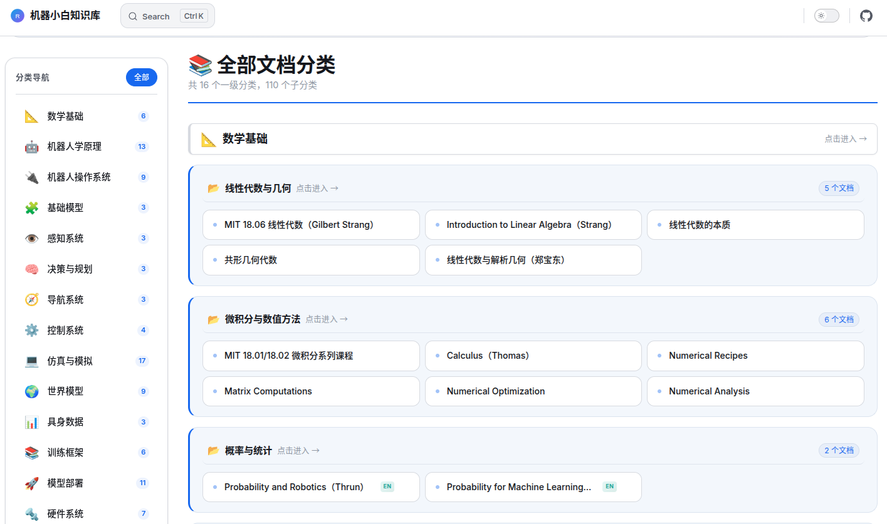

# 机器小白知识库

## 项目介绍

机器小白知识库（RobotNewbie Docs）是一个开放的具身智能机器人文档导航库，旨在系统化地整理和索引机器人学与具身智能领域的技术文档、教程和资源。

**点击图片获得更好的浏览体验**

- link: [https://docs.robotnewbie.com](https://docs.robotnewbie.com)

## 定位说明

本项目不是传统意义上的"教程网站"，而是一个**文档导航库**：

- 📚 **聚合索引**：汇集各类技术文档链接，提供统一的访问入口
- 🔍 **快速检索**：通过分类体系快速定位所需资料
- 🗂️ **层级清晰**：从基础理论到具体硬件平台的多级分类
- 🌐 **开放生态**：链接到官方文档、开源项目、社区资源

## 项目概览

本知识库按照机器人技术栈分层组织，涵盖从基础理论到应用落地的完整知识体系：

| 层级 | 分类名称 | 核心内容 | 学习路径 |
|------|---------|---------|:-------:|
| **基础层** | [数学基础](math/README.md) | 微积分、线性代数、概率论、优化理论 | ⭐ 入门必修 |
| **基础层** | [机器人学原理](robotics/README.md) | 运动学、动力学、控制理论 | ⭐ 核心基础 |
| **工具层** | [机器人操作系统](ros/README.md) | ROS1、ROS2、Drake、PyRobot 等 | 🔧 开发工具 |
| **模型层** | [基础模型](foundation-models/README.md) | VLA、WAM、VLN 三大方向 | 🚀 前沿技术 |
| **感知层** | [感知系统](perception/README.md) | 2D 视觉、3D 视觉、多传感器融合 | 👁️ 环境感知 |
| **决策层** | [决策与规划](planning/README.md) | 路径规划、运动规划、任务规划 | 🧠 智能核心 |
| **导航层** | [导航系统](navigation/README.md) | SLAM、视觉导航 | 🧭 自主移动 |
| **控制层** | [控制系统](control/README.md) | 经典控制、现代控制、鲁棒控制 | 🎮 执行控制 |
| **仿真层** | [仿真与世界模型](simulation/README.md) | MuJoCo、Isaac Sim、Gazebo 等 | 🔬 虚拟验证 |
| **模型层** | [世界模型](world-models/README.md) | 各类世界模型实现 | 🌍 预测学习 |
| **数据层** | [具身数据](data/README.md) | 数据集、数据收集、评测基准 | 💾 数据基础 |
| **训练层** | [训练框架](training/README.md) | Isaac Lab、LeRobot、Habitat Lab 等 | 🎯 模型训练 |
| **部署层** | [模型部署](deployment/README.md) | vLLM、Ollama 等推理框架 | ⚡ 落地部署 |
| **硬件层** | [硬件系统](hardware/README.md) | 传感器、电机控制、嵌入式系统 | 🔩 物理实现 |
| **形态层** | [机器人形态分类](robot-forms/README.md) | 刚性、软体、模块化、群体机器人 | 🤖 形态多样性 |
| **应用层** | [应用场景](applications/README.md) | 人形、工业、医疗、服务、农业、无人机 | 🏭 场景落地 |

## 适用人群

- 🎓 **初学者**：快速了解领域知识体系，找到学习路径
- 🔬 **研究者**：查阅特定技术方向的参考资料
- 💼 **开发者**：获取硬件平台、框架工具的使用文档
- 🤖 **爱好者**：探索机器人世界的各个角落

## 关于 IP

**机器小白 / RobotNewbie** 是一个专注于具身智能机器人领域的知识 IP，致力于：

- 降低机器人技术的学习门槛
- 建立系统化的知识体系
- 连接理论与实践的桥梁

## 贡献指南

目前项目正在建设中，欢迎贡献。

可以通过以下方式参与建设：

1. **提交 Issue**：补充遗漏的文档链接、提出分类建议
2. **Pull Request**：完善导航结构、优化页面内容
3. **分享资源**：推荐优质的技术文档和教程

## 许可证

本项目内容采用 CC BY-NC 4.0 许可：

❌ 禁止用于商业出版或课程销售等任何商业用途。

代码示例（如有）将采用 AGPLv3 License。

***

**联系方式**：如有问题或建议，请通过 GitHub Issues 联系我们。
