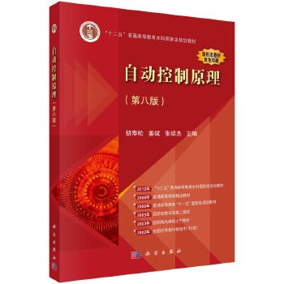

# 自动控制原理

- [自动控制原理（第八版） 胡寿松 科学出版社](https://item.jd.com/10085075693856.html)
- [视频课程](https://www.bilibili.com/video/BV1qEYyz9ENK?spm_id_from=333.788.videopod.episodes&vd_source=1ccd6967cfdb4279676e69f8ecb27014&p=4)

## 概述

### 书籍基本信息
- **书名**：自动控制原理（第八版）
- **作者**：胡寿松、姜斌、张绍杰 主编
- **出版社**：科学出版社
- **出版时间**：2023年（2025年重印）
- **定位**：国内控制类经典教材，自动化/电气工程/机器人等专业核心课，**控制考研首选参考书**。

### 作者简介（胡寿松）
- 南京航空航天大学教授、博士生导师，首届国家级教学名师。
- 从事控制理论教学60余年，主编《自动控制原理》系列教材，被全国数百所高校采用，俗称**“控制界国民教材”**。

### 核心内容架构（全书共10章）
#### 经典控制理论（第1–8章，具身/机器人基础）
1. **自动控制的一般概念**：反馈/开环/复合控制；稳定性、快速性、准确性三大指标。
2. **控制系统的数学模型**：微分方程、传递函数、结构图、信号流图（机器人建模核心）。
3. **线性系统的时域分析法**：一阶/二阶系统响应、稳定性判据（劳斯）、稳态误差（PID设计基础）。
4. **线性系统的根轨迹法**：根轨迹绘制、系统动态性能分析。
5. **线性系统的频域分析法**：奈奎斯特判据、伯德图、稳定裕度（控制系统校正必备）。
6. **线性系统的校正方法**：超前/滞后校正、PID校正（机器人关节控制直接用）。
7. **线性离散系统的分析与校正**：z变换、离散稳定性、数字控制器（机器人数字控制基础）。
8. **非线性控制系统分析**：相平面法、描述函数法、逆系统方法（真实机器人非线性分析）。

#### 现代控制理论（第9–10章，对接具身/机器人高阶）
9. **线性系统的状态空间分析与综合**：状态空间建模、能控/能观性、极点配置、状态观测器（机器人动力学/状态估计核心）。
10. **动态系统的最优控制方法**：最优控制概念、LQR、极小值原理（机器人轨迹跟踪、MPC基础）。

### 第八版更新要点（对比第七版）
1. **内容优化**：精简冗余，强化**控制理论与机器人/智能系统前沿结合**。
2. **数字资源**：新增**二维码视频/课件/习题解析**，适配线上学习。
3. **例题更新**：增加**无人机、移动机器人、电机控制**等工程实例，贴近具身智能应用。
4. **习题强化**：补充考研真题与工程应用题，适配**控制考研/机器人研发**需求。

### 对具身智能/机器人学习的价值
- **底层基础**：前8章是机器人**关节PID控制、运动稳定性、动态性能分析**的直接理论来源。
- **高阶进阶**：后2章（状态空间+最优控制）是**机器人动力学建模、LQR轨迹跟踪、状态估计、MPC**的核心前置知识。
- **考研/就业刚需**：控制考研90%院校指定教材；机器人/自动驾驶岗位笔试核心参考书。

### 配套学习资源（必备）
1. **习题解析**：《自动控制原理习题解析（第三版）》（胡寿松），课后题全解。
2. **题海/考研**：《自动控制原理题海与考研指导》（胡寿松），考研真题+模拟题。
3. **网课**：B站“胡寿松自动控制原理”配套精讲，或“东南大学 自动控制原理”国家级精品课。

### 三本经典控制教材定位
1. **胡寿松 自动控制原理**：**国内考研专用**，经典控制体系最全，做题刷题首选。
2. **多尔夫 现代控制系统**：**工程应用+MATLAB+案例多**，偏系统设计。
3. **Ogata 现代控制工程（尾形）**：**现代控制教科书天花板**，**状态空间、LQR、能控能观 学这本最舒服**，机器人/具身智能**最优学习用书**。

### 学习建议（给具身智能路线）
学控制最优顺序：
**先过一遍胡寿松经典控制 → 直接主攻 Ogata 第五版现代控制 → 再看多尔夫工程应用与MATLAB**
