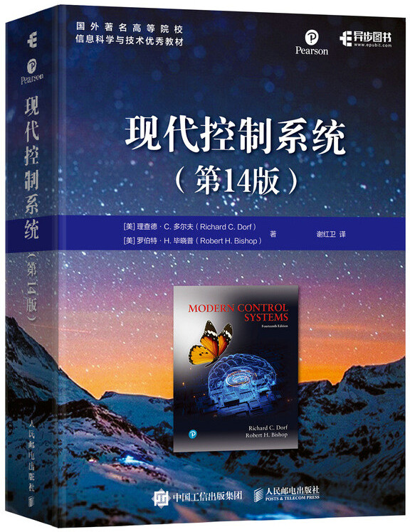

# 现代控制系统 

- [英文pdf](http://103.203.175.90:81/fdScript/RootOfEBooks/E%20Book%20collection%20-%202024/EEE/Modern_control_systems_Robert_H_Bishop_Richard_C_Dorf_z_lib_org.pdf)
- [现代控制系统（第14版）中文版本京东](https://item.jd.com/13956535.html)

## 概述

### 书籍基本信息
- **书名**：现代控制系统（第14版）
- **原著**：[美]理查德·C.多尔夫（Richard C. Dorf）、[美]罗伯特·H.毕晓普（Robert H. Bishop）
- **中文版**：电子工业出版社（2023年）
- **定位**：全球控制领域经典教材，**强调现代控制+工程实践+MATLAB/LabVIEW应用**，适合机器人、自动化、航空航天等专业。

### 作者简介
- **理查德·C.多尔夫**：加州大学戴维斯分校电气与计算机工程荣誉退休教授，IEEE/ASEE会士，PIDA控制器专利持有者，著有《工程手册》等经典工具书。
- **罗伯特·H.毕晓普**：南佛罗里达大学工学院院长，AIAA/AAS会士，曾任德州大学奥斯汀分校航天工程系主任，长期从事控制教育与机电一体化研究。

### 内容架构（全书共13章）
#### 经典控制（第1–8章，工程基础）
1. **控制系统导论**：反馈控制历史、机电一体化/绿色工程理念、设计实例（磁盘驱动器）。
2. **系统数学模型**：微分方程、传递函数、结构图/信号流图、机电系统建模（机器人关节建模核心）。
3. **状态空间模型**：状态变量、矩阵表示、时域响应（现代控制入门，机器人动力学基础）。
4. **反馈控制系统特性**：反馈优势、误差信号、灵敏度分析。
5. **反馈控制系统性能**：时域指标（超调/稳态误差）、零极点分布、频率响应。
6. **线性反馈系统稳定性**：劳斯判据、奈奎斯特判据、伯德图稳定裕度。
7. **根轨迹法**：参数变化对极点影响、控制器设计（PID/超前-滞后校正）。
8. **频率响应法**：伯德图/奈奎斯特图、稳定性分析、闭环频域性能。

#### 现代控制与进阶（第9–13章，机器人/具身智能核心）
9. **频域稳定性**：相对稳定性、增益/相位裕度、鲁棒性基础。
10. **反馈控制系统设计**：超前/滞后校正、PID设计、MATLAB工具应用（机器人底层控制直接用）。
11. **状态反馈系统设计**：能控/能观性、极点配置、状态观测器（LQR/卡尔曼滤波前置，机器人状态估计核心）。
12. **鲁棒控制系统**：不确定性建模、鲁棒稳定性、H∞控制（应对机器人非线性/干扰）。
13. **数字控制系统**：z变换、采样系统、数字控制器设计（机器人数字控制/嵌入式开发基础）。

### 第14版更新
1. **工程案例强化**：新增**无人机、移动机器人、自动驾驶、新能源系统**实例，贴近具身智能应用。
2. **计算工具整合**：全书嵌入**MATLAB/LabVIEW MathScript**代码与习题，强化计算机辅助设计能力。
3. **习题更新**：20%习题新增/修订，含**980+不同难度习题**（基础/进阶/设计/计算机题）。
4. **理念升级**：强调**绿色工程、人机协同、可解释控制**，契合智能系统发展趋势。

### 对具身智能/机器人学习的价值
- **底层必备**：第1–8章+第13章是**机器人关节PID、运动稳定性、数字控制**的直接理论来源。
- **高阶核心**：第11–12章（状态空间+鲁棒控制）是**机器人动力学建模、LQR轨迹跟踪、状态估计、MPC**的核心前置知识。
- **能力培养**：全书强调**建模—分析—设计—验证**全流程，适配具身智能“**感知—决策—控制—执行**”闭环开发需求。

### 配套学习资源
1. **习题解答**：官方配套《Modern Control Systems Solutions Manual》（英文），国内有中文习题解析。
2. **网课**：B站“现代控制系统（第14版）”精讲，或Coursera“Control Systems Engineering”课程。
3. **工具**：MATLAB控制系统工具箱、LabVIEW MathScript（书中案例直接复用）。

### 三本经典控制教材定位
1. **胡寿松 自动控制原理**：**国内考研专用**，经典控制体系最全，做题刷题首选。
2. **多尔夫 现代控制系统**：**工程应用+MATLAB+案例多**，偏系统设计。
3. **Ogata 现代控制工程（尾形）**：**现代控制教科书天花板**，**状态空间、LQR、能控能观 学这本最舒服**，机器人/具身智能**最优学习用书**。

### 学习建议（给具身智能路线）
学控制最优顺序：
**先过一遍胡寿松经典控制 → 直接主攻 Ogata 第五版现代控制 → 再看多尔夫工程应用与MATLAB**

