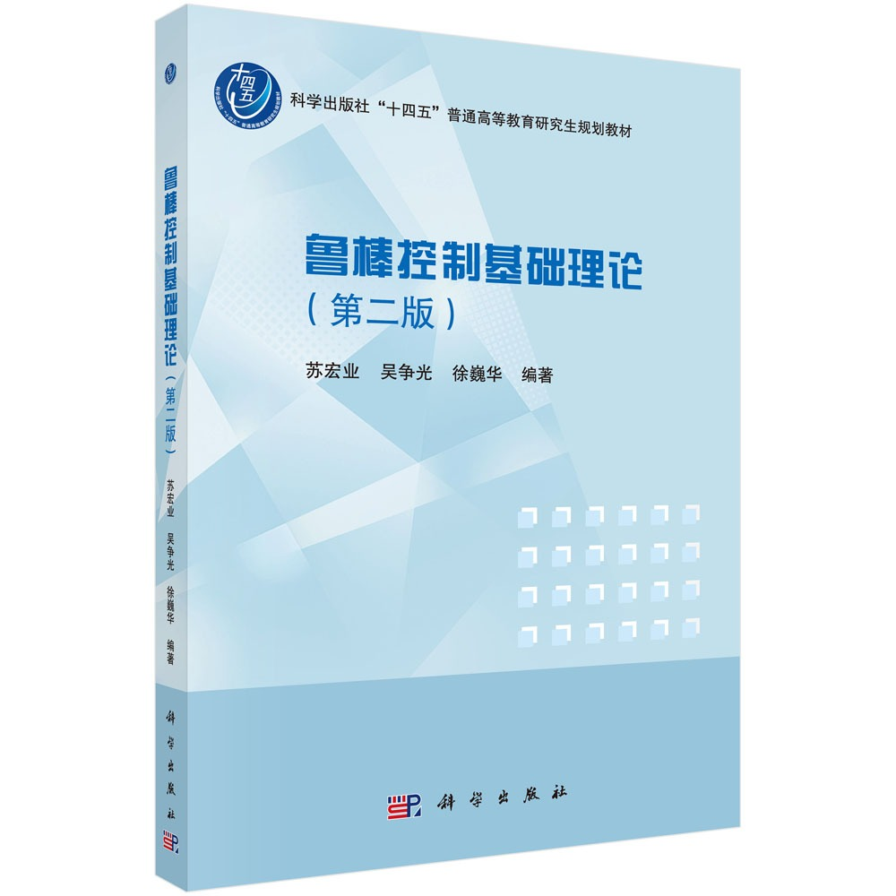

# 鲁棒控制基础理论

- [鲁棒控制基础理论（第二版）京东](https://item.jd.com/13413766.html)
- [鲁棒控制理论(浙江大学 苏宏业)视频课程](https://www.bilibili.com/video/BV1xJ411V72E/?spm_id_from=333.337.search-card.all.click&vd_source=1ccd6967cfdb4279676e69f8ecb27014)

## 概述

**定位**：国内主流**研究生级鲁棒控制入门教材**，频域+时域双线并行，从基础到核心（H∞/μ分析）再到前沿扩展，适合机器人/具身智能应对**模型不确定性、干扰、参数漂移**。

#### 基本信息
- 作者：苏宏业、吴争光、徐巍华（浙江大学控制系）
- 出版：科学出版社，2021年8月（第二版）
- 页数：241页
- 适用：控制/自动化/机械电子研究生；机器人、无人机、工业控制研发人员

#### 核心定位与特色
- ✅ **频域+时域全覆盖**：先频域（经典鲁棒）、后时域（现代鲁棒/LMI），衔接Ogata/多尔夫的状态空间与LQR，**完美补齐三本基础教材缺失的鲁棒内容**。
- ✅ **工程导向、难度适中**：避开过深数学证明，强调**不确定性建模、鲁棒稳定性、H∞设计、回路成形**，直接对接机器人模型不准、外部干扰、关节参数漂移问题。
- ✅ **第二版强化**：新增**多智能体协同、Markov跳变系统**，适配具身智能分布式控制与动态环境切换场景。

#### 全书13章结构（机器人/具身重点标注）
1. **频域数学基础**（必学）：范数、信号空间、传递函数矩阵——鲁棒控制数学基石。
2. **频域稳定性概念**（必学）：小增益定理、相位裕度/增益裕度——判断模型误差下稳定性。
3. **不确定性描述与鲁棒性分析**（核心必学）：结构/非结构不确定、μ分析——机器人**模型不准、参数摄动**建模核心。
4. **控制器参数化与镇定设计**（必学）：Youla参数化、所有镇定控制器集合——鲁棒控制器设计起点。
5. **H∞控制设计方法**（核心必学）：H∞标准问题、Riccati方程求解——机器人**抗干扰、轨迹跟踪、鲁棒LQR**核心算法。
6. **回路成形设计方法**（选学）：结合经典频域与H∞——适合**关节带宽整定、抗高频噪声**。
7. **时域鲁棒控制数学基础**（必学）：Lyapunov稳定性、LMI线性矩阵不等式——现代鲁棒设计核心工具。
8. **线性系统性能分析**（必学）：H2/H∞性能指标、多目标优化——平衡**快速性、鲁棒性、能耗**。
9. **不确定线性系统鲁棒控制**（核心必学）：状态反馈/输出反馈鲁棒镇定、鲁棒LQR——机械臂/移动机器人**模型不确定下高精度控制**主用方法。
10. **不确定时滞系统鲁棒控制**（选学）：时滞依赖稳定性、鲁棒镇定——机器人**通信延迟、视觉反馈滞后**场景。
11. **奇异线性系统鲁棒控制**（选学）：奇异系统、脉冲消除——**柔性关节、欠驱动机器人**建模。
12. **多智能体事件触发分布式协同控制**（具身前沿）：事件触发、一致性协议——**多机器人协作、集群控制**。
13. **Markov跳变系统分析与非同步综合**（具身前沿）：随机跳变、非同步控制——**动态环境、故障切换**场景。

#### 习路径建议（适配机器人/具身智能）
1. **先修**：Ogata第6–9章（状态空间+能控能观+极点配置+LQR）→ 直接衔接本书第7–9章（时域鲁棒+鲁棒LQR）。
2. **核心必学（7章）**：1→2→3→5→7→8→9（鲁棒控制主干，解决模型不准与干扰）。
3. **具身扩展（2章）**：12→13（多智能体协同+动态环境切换）。
4. **跳过**：4（参数化理论）、6（回路成形）、10（时滞）、11（奇异系统）（非刚需）。

#### 对比同类书（国内鲁棒教材）
- **《鲁棒控制基础理论（第二版）》（苏宏业）**：频域+时域均衡，难度适中，**最适合从基础控制过渡到鲁棒控制**，机器人适配性强。
- **《鲁棒控制理论》（吴敏）**：偏理论，μ分析与非线性鲁棒更深，**适合学术研究**。
- **《不确定系统鲁棒控制——时域方法》（胡军）**：纯时域LMI，**适合偏重状态空间设计**。