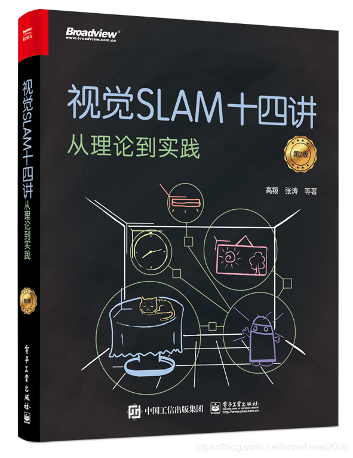

# 视觉SLAM十四讲：从理论到实践 第二版

- [GitHub](https://github.com/gaoxiang12/slambook2)

## 概述

### 书籍基本信息
- **书名**：《视觉SLAM十四讲：从理论到实践（第2版）》
- **作者**：高翔、张涛、刘毅、颜沁睿
- **出版社**：电子工业出版社
- **出版时间**：2019年8月
- **ISBN**：978-7-121-36942-1
- **定价**：108.00元
- **页数**：xi, 396页

### 作者简介
- **高翔**：清华大学自动化系博士，慕尼黑工业大学博士后，现任某科技公司算法专家，长期从事SLAM与计算机视觉研究。
- **张涛、刘毅、颜沁睿**：均为SLAM领域资深工程师与研究者，具备丰富的理论与工程实践经验。

### 内容架构（十四讲）
全书分为**数学基础、理论核心、实践应用**三大部分，层层递进：
1. **基础数学（第1–3讲）**：三维刚体运动、李群李代数、相机成像模型、非线性优化基础。
2. **前端视觉里程计（第4–6讲）**：特征提取与匹配（ORB/FAST）、对极约束、PnP/ICP算法、单目/双目/RGB-D里程计。
3. **后端优化（第7–9讲）**：光束平差法（BA）、图优化（g2o/Ceres）、位姿图优化、边缘化与稀疏求解。
4. **回环检测与建图（第10–12讲）**：词袋模型（BoW）、相似度计算、回环验证、稠密/稀疏地图构建。
5. **系统集成与进阶（第13–14讲）**：SLAM系统框架、性能评估、误差分析、动态/语义SLAM前沿方向。

### 核心特色
- **理论+实践深度融合**：从数学推导到C++代码实现，配套GitHub开源项目（含数据集与评测脚本），可直接运行。
- **内容全面系统**：覆盖视觉SLAM全链路，兼顾单目/双目/RGB-D方案，解析主流算法（如ORB-SLAM、DSO）核心原理。
- **难度梯度友好**：从零基础数学铺垫到前沿技术，适合循序渐进学习，避免理论与工程脱节。
- **第2版大幅增补**：相比第1版新增约40%内容，强化非线性优化、图优化、RGB-D SLAM与工程实践案例。
