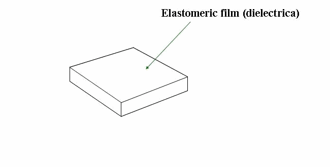

# 介电弹性体驱动器

<figure style="text-align: center; margin: 1.5rem 0;">
  
  <figcaption style="font-size: 0.9rem; color: #666; margin-top: 0.5rem;">介电弹性体执行器的工作原理：弹性体薄膜两侧涂有电极，电极连接到电路。施加电压 \(U\) 时，静电压力 \(p_{el}\) 产生作用。由于机械压缩，弹性体薄膜在厚度方向收缩，在薄膜平面方向膨胀。当电路短路时，弹性体薄膜恢复到原始位置。</figcaption>
</figure>

介电弹性体（Dielectric Elastomer, DE）是一种智能软材料，施加电压后会产生变形，是一种很有前景的人工肌肉材料，具有响应快、效率高、应变大的特点。

## 工作原理

**结构**：
- 介电弹性体薄膜
- 两侧涂柔性电极
- 施加高压电压

**原理**：
- 施加高压 → 静电吸引力压缩薄膜
- 厚度减小，面积扩大
- 移除电压 → 弹性恢复原形状

**典型性能**：
- 应变：>100%面积应变
- 响应速度：毫秒级
- 能量密度：接近人体肌肉

## 分类

| 构型 | 应用 |
|------|------|
| **圆形扩张** | 泵、扬声器 |
| **折叠折叠** | 线性驱动器 |
| **扭转** | 旋转关节 |
| **锥形** | 鱼尾部推进 |

## 特点

### ✅ 优点
- **响应快**：毫秒级响应
- **效率高**：电-机械能转换效率高
- **无声驱动**：工作无噪音
- **无电磁干扰**：不会产生磁场

### ❌ 缺点
- **高压需求**：通常需要几千伏电压
- **材料寿命**：容易产生电击穿
- **蠕变**：长时间加载有蠕变
- **电极技术**：柔性电极仍需改进

## 应用

- **仿生游泳机器人**：软体机器鱼
- **人工肌肉**：假肢和康复
- **振动能量收集**：环境能量收集
- **扬声器**：宽频带声学换能器
- **可调透镜**：焦点可调光学透镜

## 代表性研究项目

- **Harvard DEA** - 哈佛大学介电弹性体研究
- **EPFL Soft Transducers** - EPFL介电弹性体研究
- **DE GitHub** - 开源DEA项目

## 技术挑战

1. **提高寿命**：抗电击穿材料
2. **降低驱动电压**：降低工作电压便于应用
3. **集成传感**：在驱动器中集成传感
4. **规模化制造**：低成本批量制造

## 发展前景

介电弹性体被认为是最接近人体肌肉性能的人工肌肉之一，在仿生机器人和可穿戴设备有广阔前景。随着材料和制造技术进步，实际应用正在加速。
