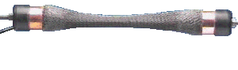

# 气动人工肌肉

<figure style="text-align: center; margin: 1.5rem 0;">
  
  <figcaption style="font-size: 0.9rem; color: #666; margin-top: 0.5rem;">气肌收缩和伸展</figcaption>
</figure>

气动人工肌肉（Pneumatic Artificial Muscle, PAM）是最经典的软体机器人驱动方式，由橡胶管和外部编织网组成，充气时收缩产生拉力，类似人体肌肉工作原理。

## 工作原理

**结构组成**：
- 内部弹性橡胶管
- 外部编织纤维网
- 两端密封接头

**工作原理**：
- 充气 → 橡胶管径向膨胀 → 编织网角度变化 → 轴向收缩
- 放气 → 弹性力恢复 → 肌肉伸长

**力-长度关系**：力随收缩率变化，最大收缩率约25%-35%

## 特点

### ✅ 优点
- **高功率重量比**：力大重量轻
- **柔顺性好**：本身具有被动柔顺性
- **结构简单**：制造容易，成本低
- **清洁无污染**：气压驱动无污染

### ❌ 缺点
- **非线性**：力输出非线性严重
- **控制困难**：高精度控制难
- **带宽低**：响应速度慢
- **需要气源**：压缩机和气管系统

## 典型应用

- **机器人假肢**：假肢手臂肌肉驱动
- **仿生行走机器人**：双足/四足机器人关节
- **柔性机械手**：抓取不规则物体
- **康复机器人**：可穿戴康复设备

## 代表项目

- **McKibben肌肉**：最经典的气动人工肌肉设计 https://en.wikipedia.org/wiki/Pneumatic_artificial_muscle
- **Shadow Hand**：气动驱动仿人手 https://www.shadowrobot.com/products/dexterous-hand/
- **OpenPAM**：开源气动人工肌肉项目 https://github.com/openpam

## 研究热点

- **建模与控制**：非线性控制方法
- **集成传感**：在肌肉中集成变形传感器
- **小型化**：微型气动人工肌肉
- **材料创新**：新型编织材料和橡胶材料
