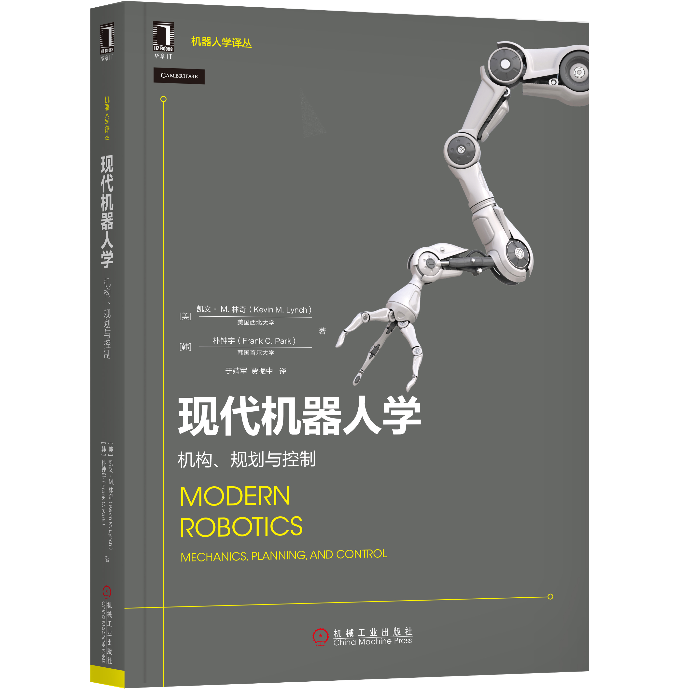

# 现代机器人学教材

**Modern Robotics: Mechanics, Planning, and Control**（《现代机器人学：机构、规划与控制》）是由美国西北大学Kevin M. Lynch教授与首尔国立大学Frank C. Park教授合著、剑桥大学出版社2017年出版的**机器人学经典权威教材**，已推出中文、韩文等译本，是全球高校机器人相关课程的核心用书与从业者必备参考资料。

## 官网资源

https://modernrobotics.org/

## 核心定位与特色
- 以**李群李代数**为统一框架，清晰讲解现代运动学核心理论，打破"该理论过于复杂、不适用于本科教学"的传统认知，兼顾本科生入门与研究者深造需求。
- 内容体系完整、逻辑严谨，覆盖机器人学全链条核心知识，理论与实践结合紧密，配套资源全面，适配课堂教学与自主学习。
- 2019年推出**更新第一版（第3次印刷）**，修正错误、补充细节，线上预印本与正式版内容高度一致，可免费获取学习。

## 完整知识体系（核心章节）
1. 构型空间、刚体运动
2. 正向运动学、速度运动学与静力学
3. 逆向运动学、闭链机构运动学
4. 开链机构动力学
5. 轨迹生成、运动规划
6. 机器人控制、抓取与操作
7. 轮式移动机器人
8. 附录：常用公式、旋转表示、DH参数、优化方法等

## 超全配套学习资源
### 1. 教材版本
- 正式精装版：剑桥大学出版社出版，排版精良、图表优化，为官方权威版本。
- 免费线上预印本：2019年12月更新版，含带超链接、平板适配、大字体、2页合一打印等多格式，约7MB，适配电脑、平板、打印学习。
- 译本：机械工业出版社中文版、韩国Acorn出版社韩文版。

### 2. 教学与练习资源
- 配套视频：Lightboard录制的高清课程视频，支持专属页面与YouTube观看。
- 教学课件：PPT/PDF格式总结课件，覆盖核心章节，含课堂互动习题，适配50分钟课堂教学。
- 练习题与线性代数复习：带答案的实践习题、首尔国立大学历年考题及解答、线性代数补充资料。
- 习题答案手册：教师可通过剑桥大学出版社资源专区申请获取。

### 3. 软件与仿真
- 开源代码：GitHub提供Python、MATLAB、Mathematica三种语言实现，辅助理论理解。
- 仿真平台：适配CoppeliaSim（原V-REP），提供UR5、KUKA youBot等机器人场景，支持运动学、动力学、控制算法实验与动画演示。

### 4. 在线课程
- Coursera专项MOOC：6门短课，覆盖机器人运动基础、运动学、动力学、规划控制、移动操作等，含结业项目。
- edX课程：《Robot Mechanics and Control》Part I/II， notations与教材略有差异，可互补学习。

## 适用人群与前置基础
- 适用：机械、电子、自动化、计算机等专业本科生/研究生，机器人研发工程师、科研人员。
- 前置知识：大学物理（力学）、线性代数、微积分、常微分方程基础，基础编程能力即可。

## 行业评价
该书被IEEE Control Systems Magazine评价为**"以现代统一方法重塑机器人学教学，注定成为领域经典"**，哈佛、卡内基梅隆等高校教授均认可其清晰易懂的讲解与极强的教学价值。
