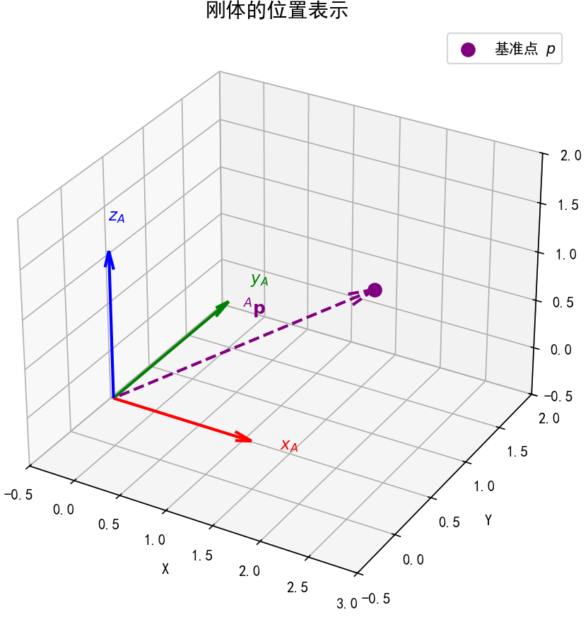
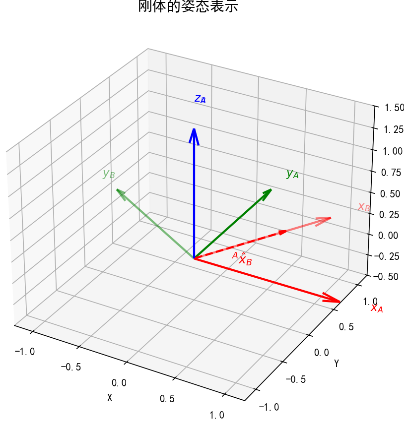
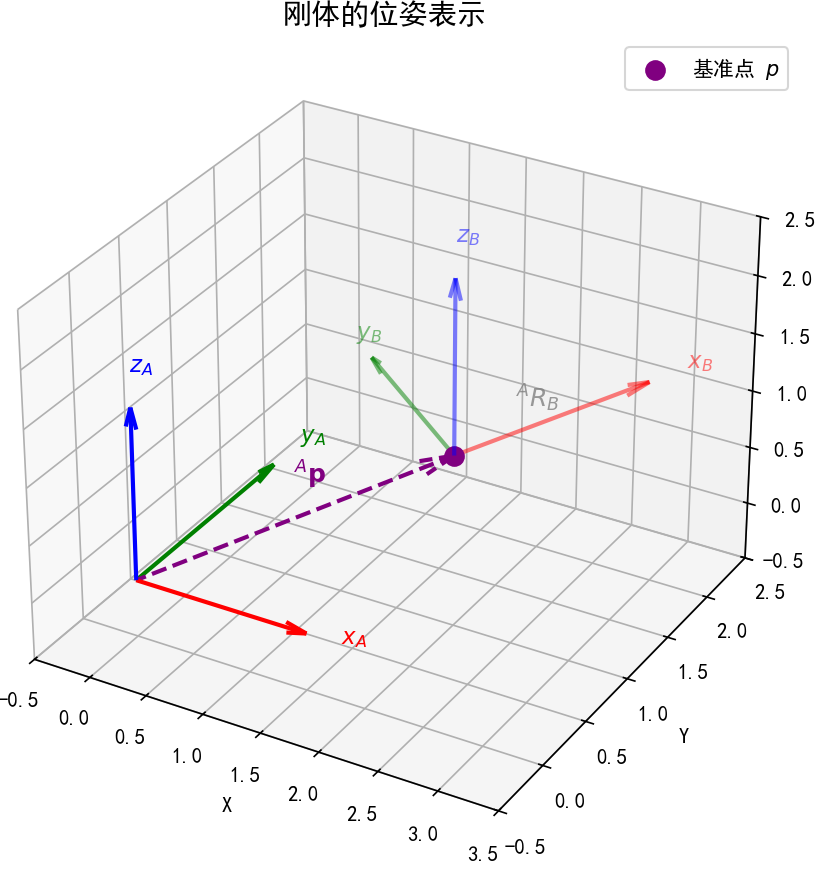
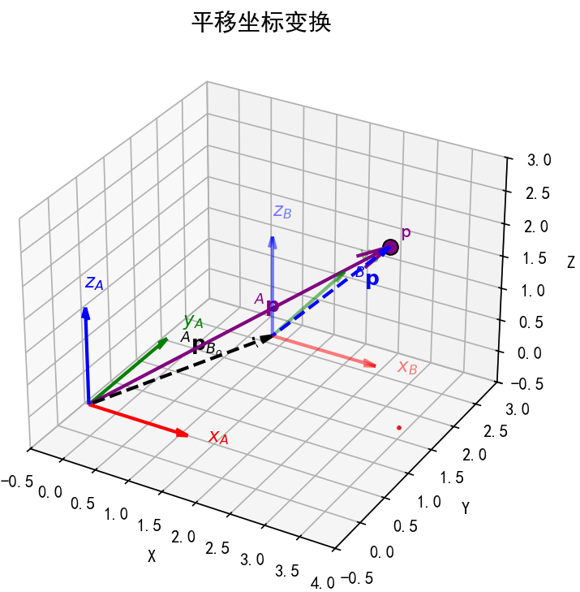
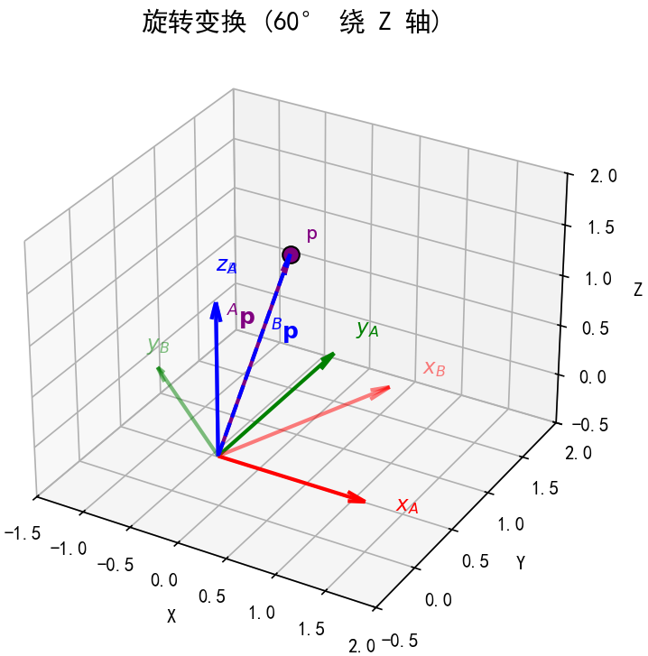
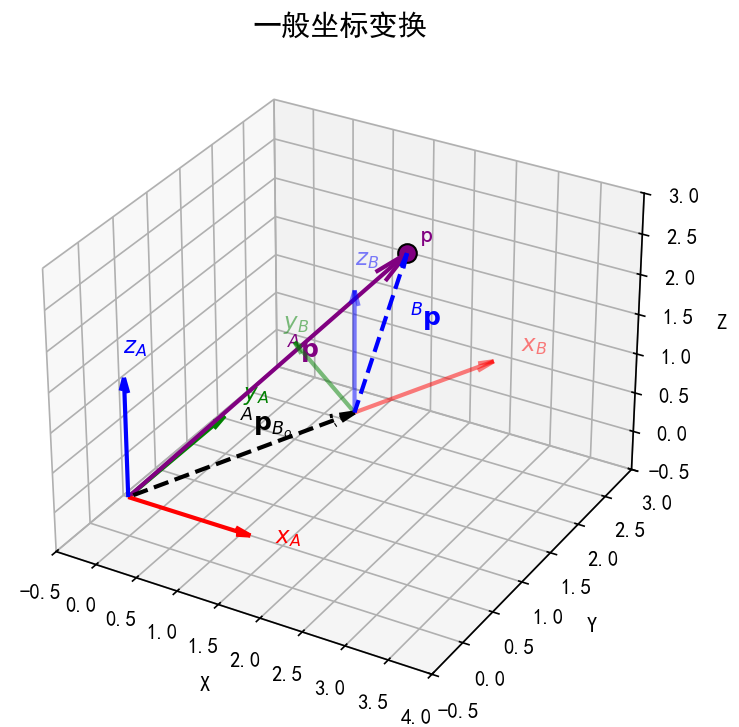

# 位姿表示和坐标变换
## 1 刚体的位姿表示
### 1.1 刚体的位置表示：描述 “刚体的基准点 p 在哪里”
对于机器人等刚体，其 “位置” 需通过一个**基准点 p**（通常选择刚体的几何中心、质心或关键功能点，如机器人末端执行器的中心点）来定义，本质是该基准点 p 相对于参考坐标系原点的偏移关系，用位置向量即可描述。

+ 定义：设以坐标系 $\{A\}$ 为参考系，刚体的基准点为 $p$（如机器人末端中心），则 **刚体相对于{A}系的位置** 可表示为向量 ${}^A \mathbf{p}$。 

    - 符号含义：上标 $A$ 表示 “参考坐标系为 $\{A\}$”，下标 $p$ 表示 “目标是刚体的基准点 p”；
    - 几何意义：该向量的起点为 $\{A\}$ 系原点，终点为刚体基准点 p，唯一确定了刚体基准点 p 在 $\{A\}$ 系中的空间位置；
+ 数学形式：在 3D 空间中，${}^A \mathbf{p}$ 是 3×1 列向量，即 ${}^A \mathbf{p} = \begin{bmatrix} x \\ y \\ z \end{bmatrix}$（$x、y、z$ 分别为基准点 p 在 $\{A\}$ 系 $x、y、z$ 轴上的坐标值）；
+ 示例：描述机器人末端执行器位置时，常以末端法兰盘中心为基准点 p，用该向量表示其在机器人基系（$\{A\}$）中的坐标。

### 1.2 刚体的姿态表示：描述 “刚体朝哪个方向”
刚体的 “姿态” 指其自身固连坐标系 $\{B\}$ 相对于参考坐标系 $\{A\}$ 的 “朝向差异”，需通过旋转矩阵定量描述 —— 本质是坐标系 $\{B\}$ 的坐标轴相对于参考坐标系 $\{A\}$ 坐标轴的指向关系。

+ 定义：设刚体自身固连一个坐标系 $\{B\}$（称为 “刚体坐标系”，随刚体同步运动），以参考坐标系 $\{A\}$ 为基准，则 **刚体相对于{A}系的姿态** 由旋转矩阵 ${}^A R_B$ 表示。

    - 符号含义：上标 $A$ 表示 “参考坐标系为 $\{A\}$”，下标 $B$ 表示 “目标是刚体坐标系 $\{B\}$”，即 “$\{B\}$ 系相对于 $\{A\}$ 系的姿态”；
    - 几何意义：旋转矩阵的每一列对应刚体坐标系 $\{B\}$ 的坐标轴在 $\{A\}$ 系中的单位向量，即：

$$
{}^A R_B = \begin{bmatrix}  | & | & | \\
{}^A \hat{x}_B & {}^A \hat{y}_B & {}^A \hat{z}_B \\ | & | & |
\end{bmatrix}
$$

其中 ${}^A \hat{x}_B$、${}^A \hat{y}_B$、${}^A \hat{z}_B$ 分别是 $\{B\}$ 系 $x、y、z$ 轴单位向量在 $\{A\}$ 系中的表示，通过这三个向量可完全确定刚体的朝向（如机器人末端的 “俯仰”“偏航”“滚转” 状态）；

+ 核心特性：仅关注 “刚体的朝向”，不涉及 “刚体的位置”，是纯粹的 “姿态描述工具”；
+ 示例：机器人抓取物体时，需通过 ${}^A R_B$ 确保末端执行器的姿态与物体的摆放方向匹配（如水平抓取、垂直抓取）。

### 1.3 刚体的位姿表示：同时描述 “刚体在哪里” 和 “刚体朝哪个方向”
刚体在空间中的完整状态，需同时包含 “位置”（基准点 p 的偏移）和 “姿态”（固连坐标系 $\{B\}$ 的朝向）—— 这种综合状态称为 “位姿（Pose）”，是机器人运动规划、定位控制的核心描述量。

+ 定义：刚体的位姿是 “位置” 与 “姿态” 的结合体，需用 “基准点 p 位置向量 + 旋转矩阵” 的组合来描述，完整刻画刚体的空间状态。

+ 数学形式：以 $\{A\}$ 系为参考系时，刚体的位姿可表示为 $\{ {}^A R_B,\ {}^A \mathbf{p} \}$，其中：

    - ${}^A R_B$ 描述刚体的姿态（固连坐标系 $\{B\}$ 的朝向）；
    - ${}^A \mathbf{p}$ 描述刚体基准点 p 的位置（偏移）；
+ 几何意义：既通过 ${}^A \mathbf{p}$ 确定了刚体 “在哪里”（基准点 p 的空间坐标），又通过 ${}^A R_B$ 确定了刚体 “朝哪个方向”（固连坐标系 $\{B\}$ 的指向），二者结合可唯一确定刚体在空间中的位置和姿态；
+ 应用场景：
    - 机器人运动规划：需通过位姿 $\{ {}^A R_B,\ {}^A \mathbf{p} \}$ 定义末端执行器的目标状态（如 “移动到坐标 (0.5, 0.3, 0.8) 且姿态为水平朝上”）；
    - 刚体定位：工业机器人安装时，需通过位姿描述机器人底座相对于工作台坐标系的位置和朝向；
    - 物体抓取：视觉引导机器人抓取时，需先识别目标物体的位姿，再调整末端执行器的位姿以匹配抓取需求。

## 2 坐标变换
### 2.1 平移坐标变换：仅描述“原点位置差异”
平移坐标变换的核心是：**两个坐标系的姿态完全相同（坐标轴方位一致），仅原点位置不同**。此时，同一点在两个坐标系中的坐标差异，仅由“原点的相对位置矢量”决定。

#### 2.1.1 关键特征
1. **姿态不变**：两个坐标系的x、y、z轴方向完全平行（无任何旋转）。  
例如：坐标系{A}固定在桌面左上角，坐标系{B}固定在桌面右下角，两者x轴都沿桌面水平向右，y轴沿桌面竖直向前，z轴垂直桌面向上——仅原点位置不同，姿态完全一致。
2. **变换关系**：设坐标系{B}的原点相对于{A}的原点的位置矢量为${}^A p_{B_o}$（上标“A”表示在{A}中描述，下标“$B_o$”表示{B}的原点），则任一点p的坐标满足：	

$$
 ^A \mathbf{p} = ^B \mathbf{p} + ^A \mathbf{p}_{B_o} 
$$

   （$^A \mathbf{p}$是p在{A}中的坐标，$^B \mathbf{p}$是p在{B}中的坐标，${}^A \mathbf{p}_{B_o}$ 代表坐标系 {B} 的原点在坐标系 {A} 中的位置向量）

  

1. **本质**：仅解决“原点在哪里”的问题，不涉及“坐标轴朝哪个方向”。

### 2.2 旋转坐标变换：仅描述“坐标轴姿态差异”
旋转坐标变换的核心是：**两个坐标系的原点完全重合（位置相同），仅坐标轴方位不同**。此时，同一点在两个坐标系中的坐标差异，由“描述姿态的旋转矩阵”决定。

#### 2.2.1 关键特征
1. 位置不变：两个坐标系共享同一个原点（无任何平移）。  
例如：坐标系{A}的x轴沿水平向右，坐标系{B}的原点与{A}重合，但{B}的x轴绕z轴（垂直地面）转了30°——仅姿态不同，位置完全一致。

2. **核心工具：**旋转矩阵

旋转矩阵记为 ${}^A R_B$，表示坐标系 {B} 相对于坐标系 {A} 的姿态。它是一个 3×3 正交矩阵，满足 ${}^A R_B^\top = {}^A R_B^{-1}$ 这一特性。其核心作用是将在 {B} 系中描述的向量坐标，转换为在 A 系中描述的坐标，具体公式如下：

${}^A \mathbf{p} = {}^A R_B \cdot {}^B \mathbf{p}$

旋转矩阵的列向量具有明确几何意义，每一列分别对应坐标系 B 的 x、y、z 轴单位向量在坐标系 {A} 中的表示，其矩阵形式可写为：

$$
{}^A R_B = \begin{bmatrix}
| & | & | \\
{}^A \hat{x}_B & {}^A \hat{y}_B & {}^A \hat{z}_B \\
| & | & |
\end{bmatrix}
$$

1. **本质**：仅解决“坐标轴朝哪个方向”的问题（即姿态），不涉及“原点在哪里”的位置问题。

### 2.3 一般坐标变换公式
当两个坐标系（如 {A} 系与 {B} 系）存在位姿差异（既含姿态差异，又含原点偏移）时，空间中点 p 在两坐标系下的坐标转换，需同时考虑 “姿态补偿”（旋转矩阵）和 “位置补偿”（原点偏移向量），具体公式如下：

$$
 {}^A \mathbf{p} = {}^A R_B \cdot {}^B \mathbf{p} + {}^A \mathbf{p}_{B_o} 
$$

+ 公式含义：将 {B} 系中描述的点 p 坐标（${}^B \mathbf{p}$），先通过 ${}^A R_B$ 补偿姿态差异，再通过 ${}^A \mathbf{p}_{B_o}$ 补偿原点偏移，最终得到 {A} 系中描述的点 p 坐标（${}^A \mathbf{p}$）；
+ 与位姿的关联：该公式本质是 “位姿 $\{ {}^A R_B,\ {}^A \mathbf{p}_{B_o} \}$” 在坐标转换中的具体应用，完整覆盖了 “姿态” 和 “位置” 的双重差异。

