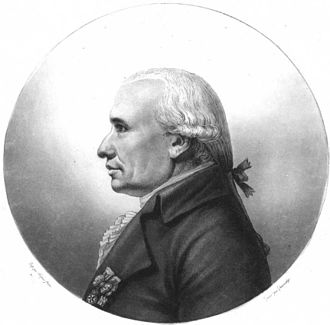
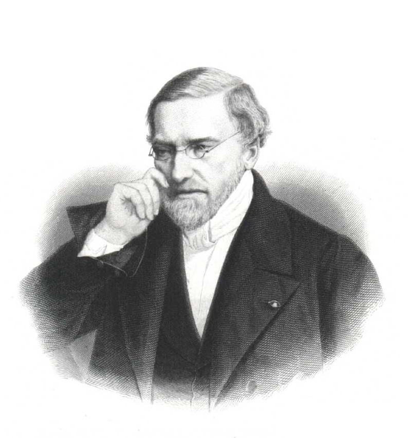
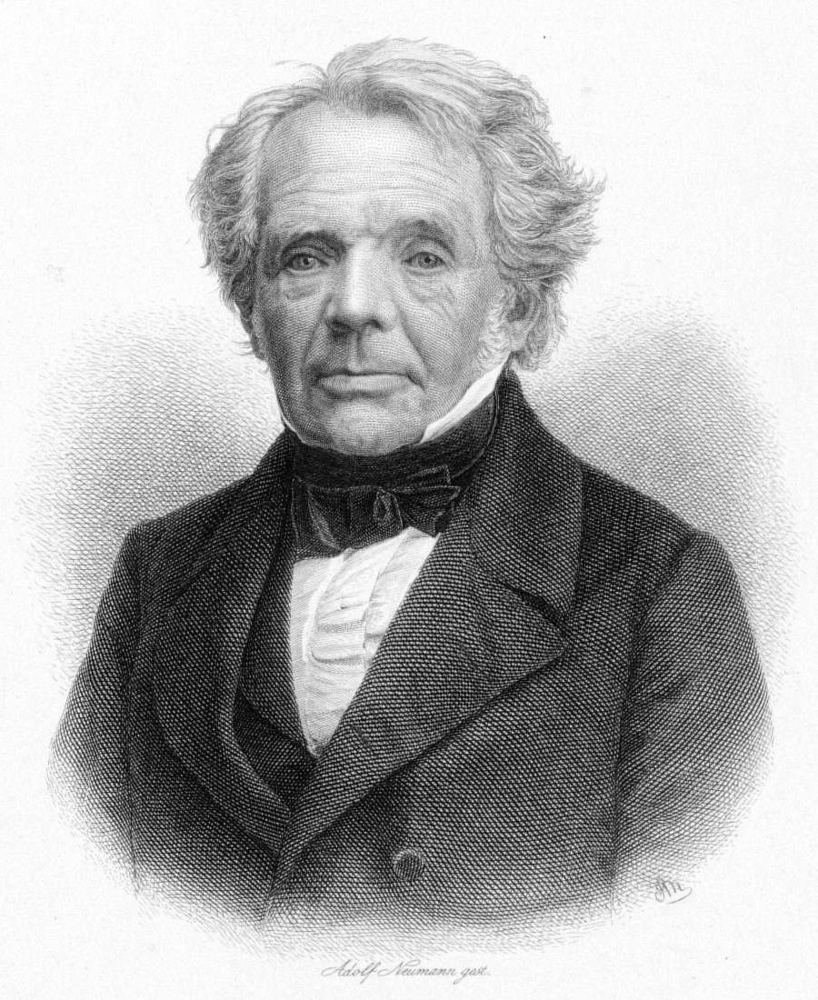
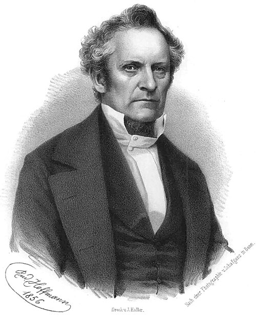
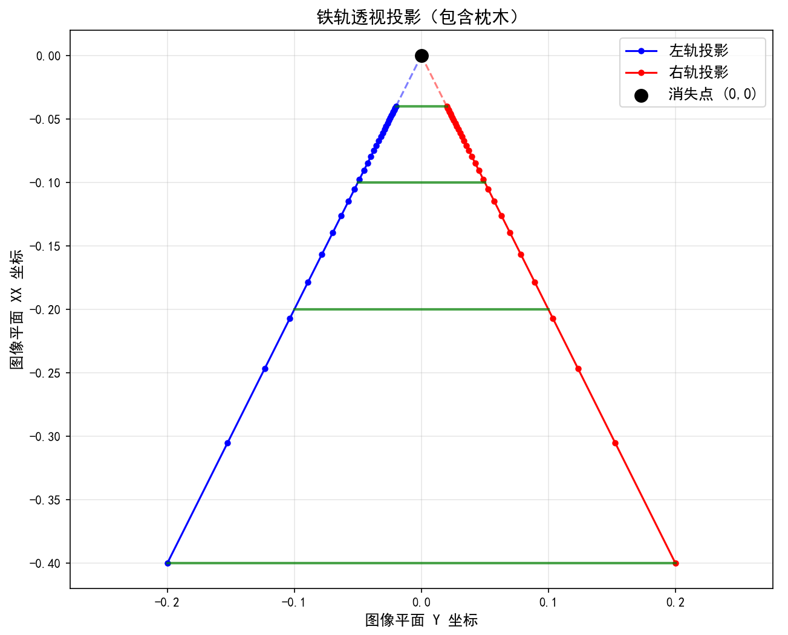

# 齐次坐标背后的故事-欧氏几何中“平行线永不相交”的问题


## 1 历史
### 1.1 早期铺垫（文艺复兴时期）
**菲利波·布鲁内莱斯基（Filippo Brunelleschi, 1377-1446）** 和 **列奥纳尔多·达·芬奇（Leonardo da Vinci, 1452-1519）** 等艺术家在文艺复兴时期就利用透视绘画技巧，直观地展示了平行线在遥远的地平线上汇聚于一点，即“灭点”的现象。这虽然是一种艺术实践，但为后来的数学家提供了重要的几何直觉。

### 1.2 概念的数学化（17世纪）
**热拉尔·德萨格（Girard Desargues, 1591-1661）** 是第一位将这一概念进行数学形式化的人。他引入了“无穷远点”的概念，将欧氏几何中的平行线视为在无穷远点相交的特殊情况。通过这种方式，德萨格将欧氏几何纳入了一个更普适的几何体系中，但他的工作当时并未被广泛理解和接受。

### 1.3 体系的建立与完善（19世纪）
#### 1.3.1 盖斯帕尔·蒙日 (Gaspard Monge，1746-1818)  


+ **时间**：蒙日的画法几何体系在18世纪末（1799年出版）形成。
+ **生平**
    - **早年与发明**：蒙日于1746年5月9日出生在法国博讷。他早年就展现出非凡的数学才能。在法国梅济耶尔皇家工程学院工作时，他发明了画法几何，这是一种用于精确表示三维物体的方法，最初被视为军事机密。
    - **法国大革命与教育改革**：在法国大革命期间，他积极参与政治，曾担任海军部长，并参与了度量衡制度的建立。他是巴黎综合理工学院的创始人之一，并在此任教，培养了包括彭塞莱在内的许多杰出学生。
    - **与拿破仑的联系**：他与拿破仑关系密切，曾随拿破仑远征埃及，并担任埃及科学和艺术研究院院长。他在拿破仑倒台后失宠，并于1818年在巴黎去世。
+ **对齐次坐标的贡献**：
    - 蒙日并未直接发明齐次坐标，但他创立的**画法几何**为射影几何和齐次坐标的出现提供了至关重要的理论基础。
    - 画法几何是一种在二维平面上精确表示三维物体的方法，通过正交投影将三维空间中的点和线投射到两个投影平面上。
    - 他的工作让数学家们开始系统地思考如何将三维空间中的对象用二维图形来表示，这直接启发了彭塞莱等人在射影几何领域的探索。 

#### 1.3.2 让-维克多·彭塞莱 (Jean-Victor Poncelet, 1788-1867) — 射影几何的复兴 


+ **时间**：彭塞莱在1812-1814年被囚期间构思，并于1822年出版了《论图形的射影性质》一书。
+ **生平**
    - **早年与军事生涯**：彭塞莱于1788年7月1日出生在法国梅斯。他毕业于著名的巴黎综合理工学院，之后成为一名军事工程师。1812年，他参加了拿破仑入侵俄国的战役，被俘并关押在萨拉托夫长达两年之久。
    - **监狱中的数学研究**：在狱中，彭塞莱利用这段时间深入研究射影几何，并构思了他最重要的著作《论图形的射影性质》(_Traité des propriétés projectives des figures_)。
    - **后期职业**：回到法国后，他继续其军事和学术生涯，最终晋升为将军，并担任巴黎综合理工学院的指挥官。他于1867年在巴黎去世。
+ **对齐次坐标的贡献**：
    - 彭塞莱是现代射影几何的奠基人，他系统地发展了德扎格和帕斯卡等早期几何学家的思想，为齐次坐标的代数化提供了坚实的几何框架。
    - 他提出了**连续性原理**，即通过引入无穷远点，使得一些在欧几里得几何中需要特殊处理的情况（如平行线）得以统一处理。
    - 他的理论证明了，所有圆锥曲线都可以通过对圆进行射影变换得到，从而将原本离散的几何对象统一了起来。
    - 虽然他主要采用综合几何的方法（不依赖坐标），但他所建立的理论为莫比乌斯和普吕克将射影几何代数化（即引入齐次坐标）指明了方向。 

#### 1.3.3 奥古斯特·费迪南德·莫比乌斯 (August Ferdinand Möbius, 1790-1868) — 齐次坐标的创立 


+ **时间**：莫比乌斯在1827年出版的著作《重心计算》中首次提出了齐次坐标。
+ **生平**
    - **出生与早年教育**：莫比乌斯于1790年11月17日出生在萨克森的舒尔福塔（Schulpforta），他的家族与新教改革家马丁·路德有渊源。他自幼在家接受教育，直到13岁进入舒尔福塔学院。
    - **大学与求学**：1809年，他进入莱比锡大学学习法律，但很快就转向了他真正热爱的数学、天文学和物理学。在此期间，他曾跟随著名数学家卡尔·弗里德里希·高斯在哥廷根大学学习天文学，并于1815年在高斯的老师约翰·弗里德里希·普法夫（Johann Friedrich Pfaff）的指导下完成博士论文。
    - **职业生涯**：1816年，他被任命为莱比锡大学的天文学和高等力学教授，并于1848年成为该校天文台台长。尽管教学能力平平，但他凭借卓越的研究成果赢得了学术界的尊重。他于1868年在莱比锡去世。
+ **对齐次坐标的贡献**：
    - **统一表示，解决“计算断点”**：莫比乌斯在著作《重心计算》（_Der barycentrische Calcul_）中，用重心坐标来描述点。这是一种特殊的齐次坐标，能够用有限的坐标来表示无穷远点。他通过增加一个维度，将欧氏坐标 (x,y) 转换为齐次坐标 [x,y,w]。当 ww 趋近于 0 时，欧氏坐标 (x/w,y/w) 趋近于无穷大，而在齐次坐标中，无穷远点仍有清晰的代数表示 [x,y,0]。这使得欧氏几何中“平行线永不相交”所带来的特殊情况得到了统一的处理，消除了“计算断点”。
    - **代数工具，简化几何变换**：齐次坐标使得平移、旋转、缩放和透视投影等几何变换都可以用矩阵乘法来表示，极大地简化了几何计算。
    - **几何基础的代数化**：在彭塞莱等人的几何工作基础上，莫比乌斯将射影几何的理论代数化，使得几何问题可以通过代数方法精确求解。

#### 1.3.4 尤利乌斯·普吕克 (Julius Plücker，1801-1868) — 独立发现与对偶性 


+ **时间**：普吕克与莫比乌斯几乎在同一时期，独立发展了齐次坐标的概念，其相关工作在19世纪30年代逐渐发表。
+ **生平**
    - **出生与求学**：普吕克于1801年6月16日出生于德国的埃尔伯费尔德。他曾在波恩、海德堡、柏林和巴黎等多所大学求学，深受法国几何学派的影响。
    - **职业生涯**：1829年，他成为波恩大学的教授。他早期专注于数学，后来又转向物理学，对阴极射线（最终导致电子的发现）和光谱分析做出了开创性贡献。他于1868年在波恩去世。
+ **对齐次坐标的贡献**：
    - **普吕克坐标**：普吕克是第一批明确使用齐次坐标来表示射影空间中**直线**和**平面**的数学家之一。
    - **射影对偶性**：他将射影对偶性（点和线互换角色）发展成一个系统的代数工具，证明了如果一个定理对于点的齐次坐标成立，那么相应的对偶定理对于线的齐次坐标也成立。
    - **坐标系扩展**：普吕克引入的**普吕克坐标**为三维射影空间中的直线提供了一种独特的六个齐次坐标表示方法，至今仍在计算机图形学和机器人学中有应用。

## 2 用“画铁轨透视”拆解齐次坐标如何描述“铁轨交于消失点”
### 2.1 1. 起点：我们观察到的现象
当人站在铁轨中间向前看，会看到两条物理上平行的铁轨，随着距离变远逐渐靠拢，最终在远方地平线处交汇于一个点，这个点就是**消失点**。这是人眼或相机成像的普遍视觉效果。

### 2.2 2. 矛盾：欧氏几何无法解释
在我们熟悉的欧氏几何中（即普通x-y坐标系），平行线的定义是“永不相交”。  
以铁轨为例，若左轨方程为 (y=1)，右轨方程为 (y=2)，这两条直线在欧氏平面中没有任何交点。  
但视觉上“相交”的现象与欧氏几何的规则产生冲突，说明需要更适配视觉场景的几何框架。

### 2.3 3. 解决方案：引入射影几何与齐次坐标
射影几何通过“扩展空间”解决了“平行线相交”的矛盾，而**齐次坐标**是实现这一扩展的核心数学工具。

#### 2.3.1 3.1 齐次坐标的核心规则
在二维射影平面中，一个点不再用两个数（x,y）表示，而是用三个数 (X,Y,W) 表示（需满足 (X,Y,W)≠(0,0,0)），且存在以下对应关系：

+ 当 (W≠0) 时：齐次坐标 (X,Y,W) 对应欧氏平面中的普通点 ($\frac{X}{W},\frac{Y}{W}$)；
+ 当 (W=0) 时：齐次坐标 (X,Y,0) 不对应欧氏平面的有限点，而是代表一个**方向**，称为“无穷远点”。

### 2.4 4. 关键一步：平行线在射影空间中相交于无穷远点
铁轨的关键特征是“平行且沿同一方向延伸”（比如沿x轴正方向），这一特征在射影空间中可通过齐次坐标严格证明相交：

1. 确定铁轨的方向向量：两条铁轨均沿x轴正方向延伸，方向向量为 (1,0)；
2. 方向向量对应无穷远点：在射影几何中，方向向量 (dx,dy) 对应的无穷远点，其齐次坐标为 (dx,dy,0)。因此，铁轨方向 (1,0) 对应的无穷远点为 (1,0,0)；
3. 得出结论：左轨（y=1）和右轨(y=2)虽在欧氏平面不相交，但在射影空间中，它们共享同一个方向，因此**相交于无穷远点 (1,0,0)**。



代码

```python
import matplotlib.pyplot as plt
import numpy as np
import matplotlib

# 设置中文字体（避免中文乱码）
matplotlib.rcParams['font.sans-serif'] = ['SimHei']  # 使用黑体显示中文
matplotlib.rcParams['axes.unicode_minus'] = False  # 解决负号显示问题

# 设置参数
z = np.linspace(5, 50, 30)  # 铁轨深度方向（Z坐标）
rail_left = np.column_stack([-1 * np.ones_like(z), -2 * np.ones_like(z), z])   # 左轨 (X=-1)
rail_right = np.column_stack([1 * np.ones_like(z), -2 * np.ones_like(z), z])   # 右轨 (X=1)

# 透视投影: (X, Y, Z) -> (X/Z, Y/Z)
def project(points):
    return points[:, :2] / points[:, 2:3]

left_proj = project(rail_left)
right_proj = project(rail_right)

# 绘制枕木（在几个Z位置）
ties_z = np.array([5, 10, 20, 50])
ties_left = np.column_stack([-1 * np.ones_like(ties_z), -2 * np.ones_like(ties_z), ties_z])
ties_right = np.column_stack([1 * np.ones_like(ties_z), -2 * np.ones_like(ties_z), ties_z])
ties_left_proj = project(ties_left)
ties_right_proj = project(ties_right)

# 绘图
plt.figure(figsize=(10, 8))
plt.plot(left_proj[:, 0], left_proj[:, 1], 'b-o', label='左轨投影', markersize=4, linewidth=1.5)
plt.plot(right_proj[:, 0], right_proj[:, 1], 'r-o', label='右轨投影', markersize=4, linewidth=1.5)

# 绘制枕木
for i in range(len(ties_z)):
    plt.plot([ties_left_proj[i, 0], ties_right_proj[i, 0]],
             [ties_left_proj[i, 1], ties_right_proj[i, 1]],
             'g-', linewidth=2, alpha=0.7)

# 绘制延长线指向消失点
z_far = 1000  # 一个很远的点
far_left = project(np.array([[-1, -2, z_far]]))[0]
far_right = project(np.array([[1, -2, z_far]]))[0]

plt.plot([left_proj[-1, 0], 0], [left_proj[-1, 1], 0], 'b--', alpha=0.5)
plt.plot([right_proj[-1, 0], 0], [right_proj[-1, 1], 0], 'r--', alpha=0.5)

plt.scatter([0], [0], c='black', s=100, zorder=5, label='消失点 (0,0)')
plt.title('铁轨透视投影（包含枕木）', fontsize=14)
plt.xlabel('图像平面 Y 坐标', fontsize=12)
plt.ylabel('图像平面 XX 坐标', fontsize=12)
plt.legend(fontsize=12)
plt.grid(True, alpha=0.3)
plt.axis('equal')  # 保证比例正确

plt.show()
```

### 2.5 5. 最终成像：无穷远点被投影为图像中的消失点
无穷远点本身是“看不见的”，但透视投影（人眼或相机的成像过程）会将这个“无穷远的方向点”映射到图像平面的有限位置，也就是我们看到的消失点。

以标准针孔相机模型为例：

+ 相机位于原点，光轴沿x轴正方向，图像平面设在 (x=1) 处；
+ 地面上任意一点 (x,y,0)（x>0，代表铁轨上的点），投影到图像平面的坐标为 $(\frac{y}{x},0$)；
+ 当 (x→∞)（铁轨延伸到极远）：($\frac{y}{x}→0$)，无论左轨(y=1）还是右轨（(y=2)），投影点都会趋近于 (0,0)；
+ 得出结论：图像中的 (0,0) 就是铁轨的消失点，本质是“无穷远点 (1,0,0) 经透视投影后的结果”。

### 2.6 6. 从物理到视觉的完整逻辑链
| 阶段 | 核心场景 | 关键信息 | 数学工具/表示 | 示意图（文字描述） |
| --- | --- | --- | --- | --- |
| 1 | 物理世界（现实铁轨） | 1. 铁轨为平行直线，间距固定；   2. 沿x轴正方向延伸，无实际交点 | 欧氏几何（二维直角坐标系）   左轨：(y=1)；右轨：(y=2) | 平面内两条水平直线，上下平行排列，左右无限延伸，无交汇痕迹 |
| 2 | 射影空间（数学扩展） | 1. 平行线共享同一方向向量（沿x轴：(1,0)）；   2. 方向对应唯一无穷远点，成为平行线“交点” | 齐次坐标 (X,Y,W)   无穷远点：(1,0,0)（x轴方向） | 原平行直线的“延长线”在“无穷远位置”汇聚于一点，该点无实际坐标，仅代表方向 |
| 3 | 图像成像（视觉结果） | 1. 相机/人眼将3D空间“压扁”到2D图像；   2. 无穷远点被映射为图像中的有限点（消失点） | 透视投影公式：   世界点(x,y,0)→图像点($\frac{y}{x},0$) | 图像中两条倾斜直线（铁轨投影）从两侧向中心靠拢，最终交汇于画面中心的黑色圆点（消失点：(0,0) |

## 3 “无穷远的方向点”，把“方向”说成“点”通俗理解
### 3.1 “方向也是点” = 给风向发身份证 
想象一下气象台要记录风向：

#### 3.1.1 传统方法（普通坐标）： 
+ 记录一个点：`(北京, 120, 39)`→ 这是**位置**
+ 记录一个方向：`东偏南30度`→ 这是**方向，不是位置**

**问题**：点和方向是两种完全不同的东西，无法统一处理。

#### 3.1.2 射影几何的妙招：把“风向”变成“风源点” 
射影几何说：我们假装所有的东风都来自一个**无限远的东风发射塔**！

| 实际概念 | 射影几何的表示 | 解释 |
| --- | --- | --- |
| **向东的方向** | `(1, 0, 0)` | “东风发射塔”的坐标 |
| **向北的方向** | `(0, 1, 0)` | “北风发射塔”的坐标 |
| **点(2,3)** | `(2, 3, 1)` | 普通点的坐标 |

**神奇效果**：现在方向也有了“坐标”，可以和普通点一起用同样的数学公式处理！

## 4 具体例子：为什么需要“方向也是点” 
### 4.1 场景：判断两条道路是否平行 
**传统几何**：

```text
# 道路A：通过点(0,1)和点(1,1)
# 道路B：通过点(0,2)和点(1,2) 
# 需要计算斜率：两条线斜率都是0 → 平行
```

**射影几何**：

```text
# 所有平行线都交给同一个“方向点”管理
道路A的方向点 = (1, 0, 0)  # 水平方向
道路B的方向点 = (1, 0, 0)  # 同一个方向点！

# 判断：if 道路A.方向点 == 道路B.方向点: 平行！
```

### 4.2 更直观的理解：地球仪上的“经纬度极点” 
把地球仪想象成射影平面：

+ **普通点**：北京、纽约 → 具体位置
+ **方向点**：北极点、南极点 → 不是普通城市，而是**所有经线的交汇点**

**北极点就是一个“方向点”**：

+ 它代表“向北”这个方向
+ 所有指向北的箭头都“来自”北极点
+ 但它本身不是普通城市

在射影几何中，`(1, 0, 0)`就像数学世界中的“北极点”——代表“正东方向”的抽象概念。

### 4.3 从视觉角度理解 
当你看着远方的铁轨：

+ 你的眼睛看到的不是一个具体的点，而是**视觉上的交汇方向**
+ 这个“交汇方向”在射影几何中就是一个具体的点 `(1, 0, 0)`
+ 透视投影把这个“方向点”映射到照片上的具体像素

### 4.4 终极比喻：公司组织架构 
**普通点** = 具体员工：`张三，销售部，工位101`

**方向点** = 部门职能：`销售方向，电话销售，拓展业务`

虽然“销售方向”不是具体的人，但在组织架构图里，它可以和具体员工放在同一张图上，用同样的规则管理！

### 4.5 射影几何的核心思想——把方向说成点
**(再啰嗦的讲一下)**

**在射影几何的框架内是完全严谨的**，但它不是我们日常生活中“看得见、摸得着”的物理点，而是一种经过数学定义的“抽象点”。

#### 4.5.1 1. 严谨性的来源：数学上的“等价定义”
射影几何为了统一处理“有限位置的点”和“无限延伸的方向”，专门对“点”的概念做了扩展定义：

+ 在欧氏几何中，“点”仅代表空间中的一个具体位置，用坐标（x,y）就能确定；
+ 在射影几何中，“点”被定义为“一组具有相同方向或位置的等价类”，齐次坐标（X,Y,W）就是这种等价类的表现形式。
    - 当W≠0时，（X,Y,W）对应“位置点”，等价于欧氏坐标（X/W,Y/W）；
    - 当W=0时，（X,Y,0）对应“方向点”，等价于方向向量（X,Y）——因为所有成比例的（kX,kY,0）（k≠0）都代表同一个方向，就像所有成比例的（kX,kY,W）都代表同一个位置点一样。

这种定义不是“强行类比”，而是通过严格的数学等价关系，让“方向”和“位置”拥有了相同的数学属性，满足“点”的所有公理（比如两点确定一条直线）。

#### 4.5.2 2. 为什么需要这种“严谨的抽象”？
核心目的是解决欧氏几何的“漏洞”——无法描述“平行线看似相交”的视觉现象。

+ 在欧氏几何中，平行线没有交点，因为它们的方向相同但位置不同，找不到一个共同的“位置点”；
+ 在射影几何中，平行线虽然没有共同的“位置点”，但有共同的“方向点”（即W=0的齐次坐标），这个“方向点”就成为了它们的交点。

这就像数学中把“无穷大”定义为一个特殊的数来计算极限，不是说“无穷大”是一个真实存在的数，而是通过这种抽象让运算和逻辑更完整。

#### 4.5.3 3. 避免误解：它不是“物理点”，而是“数学点”
需要明确的是，把方向说成“点”，并不意味着“方向”变成了和桌子、椅子一样的物理实体。它的严谨性只存在于数学和几何的理论框架内，是为了：

+ 让“点”的概念覆盖“位置”和“方向”两类场景；
+ 让射影变换（比如透视投影）能统一处理所有“点”，包括无穷远的方向。

比如铁轨的方向（沿x轴），在射影几何中是“点（1,0,0）”，这个表述的严谨性体现在：所有沿x轴延伸的平行线，都会在射影平面中交于这个“点”，且通过透视投影能精准映射为图像中的消失点，整个过程的数学推导完全自洽。

### 4.6 “方向也是点”的实际价值： 
+ **统一语言**：点和方向可以用同一种坐标表示
+ **简化计算**：判断平行→判断方向点是否相同
+ **描述视觉**：消失点其实就是“方向点在照片上的投影”

**简单说：射影几何发明了一种“数学黑话”，把“方向”这种抽象概念也说成是“点”，这样就能用同一套工具处理所有问题！**

