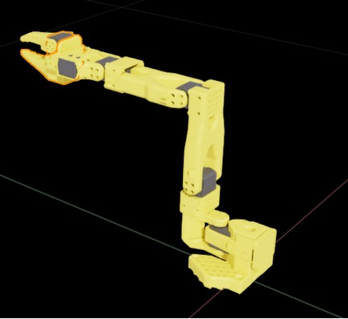
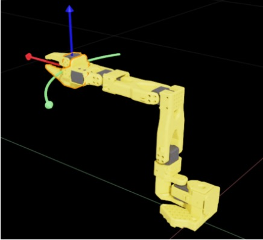
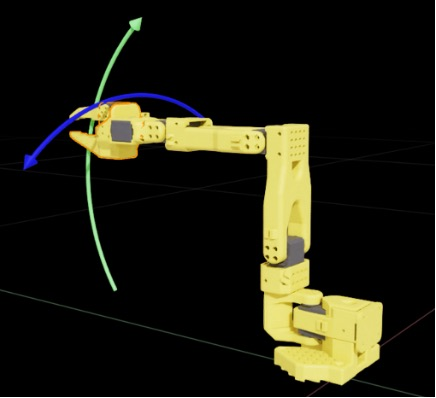

# 可用设备

::::tip
我们在仿真中支持多种遥操作设备，但为了获得最佳控制体验，我们建议使用 SO101 Leader。
::::

## 单臂 SO101 Follower

您可以使用 SO101 Leader 或键盘在仿真中控制单臂 SO101 Follower。

### SO101-Leader

使用 `--teleop_device=so101leader` 运行以启用 SO101 Leader；配置端口后，您可以立即开始操作。

当您移动物理 SO101 Leader 时，仿真机械臂会镜像相同的运动。

### 键盘

使用 `--teleop_device=keyboard` 运行以启用键盘控制。

| 目标坐标系                                               | 平移控制                          | 旋转控制                         |
| :--------------------------------------------------------: | :------------------------------------------: | :--------------------------------------: |
|  |  |  |

键盘遥操作依赖于基于目标坐标系的控制。在目标坐标系（夹爪连杆）坐标系中，按键信号始终命令该坐标系的运动，因此操作员只需关注连杆的期望位姿，而无需发送关节级命令。夹爪关节仍然单独处理。

我们将目标坐标系控制分为平移和旋转。平移涵盖目标坐标系的前/后、上/下和左/右运动。由于机械臂结构的原因，左/右动作实际上是围绕基座的旋转，而不是纯平移。旋转控制包括俯仰上/下和围绕腕部连杆的旋转。

键盘映射如下：

| 输入键 | 描述                                                                   |
| :-------: | :---------------------------------------------------------------------------- |
| `W` / `S` | 前/后，与平移图中的红色箭头对齐      |
| `A` / `D` | 左/右，与平移图中的绿色箭头对齐          |
| `Q` / `E` | 上/下，与平移图中的蓝色箭头对齐              |
| `J` / `L` | 旋转（偏航）左/右，与旋转图中的蓝色箭头对齐 |
| `K` / `I` | 旋转（俯仰）上/下，与旋转图中的绿色箭头对齐 |
| `U` / `O` | 夹爪打开/关闭                                                            |

### 游戏手柄

使用 `--teleop_device=gamepad` 运行以启用游戏手柄控制。（现在我们支持 Xbox 系列控制器。）

与键盘控制类似，游戏手柄也命令目标坐标系（夹爪连杆），并分为平移控制和旋转控制。映射如下所述。

| 控制键                          | 描述                                                                   |
| :----------------------------------: | :---------------------------------------------------------------------------- |
| 移动 `L` 向前 / 移动 `L` 向后 | 前/后，与平移图中的红色箭头对齐      |
| 移动 `L` 向左 / 移动 `L` 向右       | 左/右，与平移图中的绿色箭头对齐          |
| 移动 `R` 向前 / 移动 `R` 向后 | 上/下，与平移图中的蓝色箭头对齐              |
| 移动 `R` 向左 / 移动 `R` 向右       | 旋转（偏航）左/右，与旋转图中的蓝色箭头对齐 |
| 按下 `LB` / 按下 `LT`              | 旋转（俯仰）上/下，与旋转图中的绿色箭头对齐 |
| 按下 `RT` / 按下 `RB`              | 夹爪打开/关闭                                                            |

## 双臂 SO101 Follower

由于键盘控制对于双臂来说变得复杂，仿真中的双臂 SO101 Follower 目前仅支持 Bi-SO101 Leader。

### Bi-SO101-Leader

使用 `--teleop_device=bi-so101leader` 运行以启用 Bi-SO101 Leader。配置 `left_arm_port` 和 `right_arm_port` 后，您可以立即操作，两个仿真机械臂将重现真实的双臂行为。

## LeKiwi

LeKiwi 的遥操作可以分为两个部分，分别是单臂 SO101 Follower 的控制，以及底座的控制。

### lekiwi-leader

使用 `--teleop_device=lekiwi-leader` 运行以启用它。在此配置中，SO101 Follower 由 SO101-Leader 机械臂控制，而移动底座通过键盘驱动。

默认键盘映射如下：

| 输入键                    | 描述                             |
| :--------------------------: | :-------------------------------------- |
| :arrow_up: / :arrow_down:    | 向前 / 向后移动                 |
| :arrow_left: / :arrow_right: | 向左 / 向右移动                       |
| `Z` / `X`                    | 向左 / 向右旋转                     |
| `1` / `2` / `3`              | 设置速度级别为慢 / 中 / 快 |

### lekiwi-keyboard

使用 `--teleop_device=lekiwi-keyboard` 运行以启用它。在此配置中，SO101 Follower 和移动底座都通过键盘控制。

机械臂使用与上面描述的 [`Keyboard`](#keyboard) 配置相同的按键映射，而底座共享与 [`lekiwi-leader`](#lekiwi-leader) 配置相同的键盘控制。

### lekiwi-gamepad

使用 `--teleop_device=lekiwi-gamepad` 运行以启用它。在此配置中，SO101 Follower 和移动底座都通过游戏手柄控制。

机械臂使用与上面描述的 [`Gamepad`](#gamepad) 配置相同的映射，而移动底座使用以下布局：

| 控制键                              | 描述                                            |
| :--------------------------------------: | :----------------------------------------------------- |
| D-pad :arrow_up: / D-pad :arrow_down:    | 向前 / 向后移动                                |
| D-pad :arrow_left: / D-pad :arrow_right: | 向左 / 向右移动                                      |
| `X` / `B`                                | 向左 / 向右旋转                                    |
| `Y` / `A`                                | 增加 / 减少速度级别（慢 / 中 / 快） |
