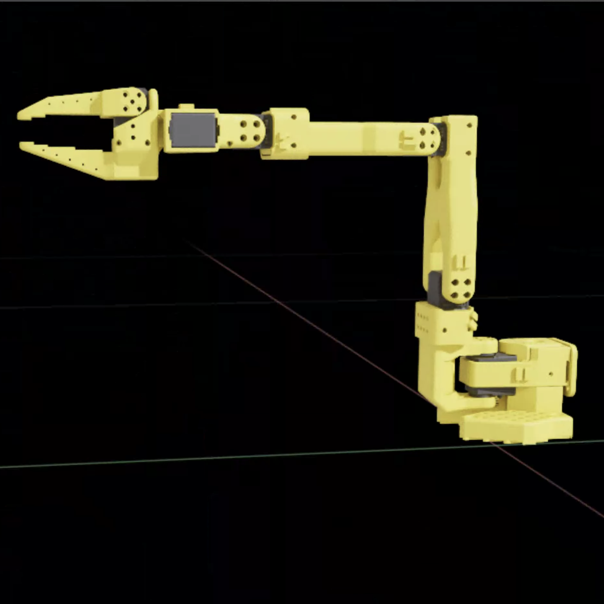
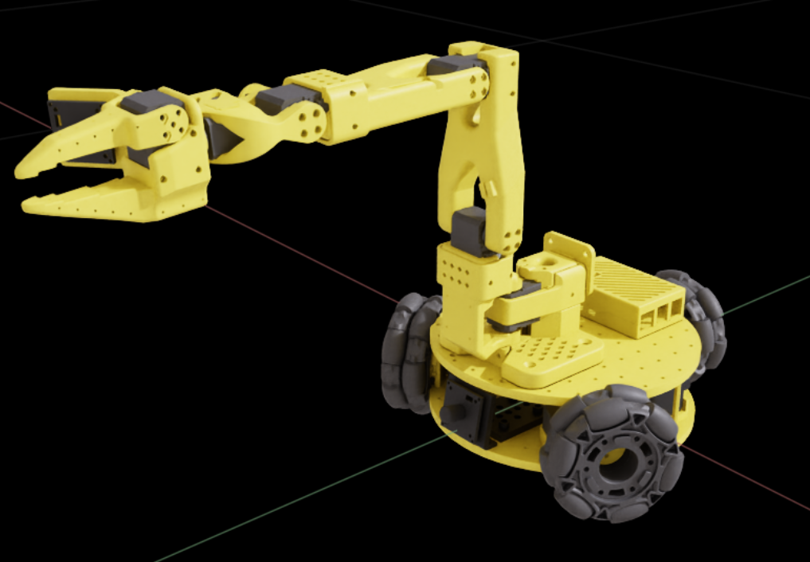

# 可用机器人

此页面列出了 LeIsaac 当前支持的机器人。未来将支持更多 LeRobot 系列机器人：

| 机器人 | USD | 描述 |
| :--- | :---: | :---------- |
| [单臂 SO101 Follower](https://huggingface.co/docs/lerobot/so101) |  | 基于 SO101 Follower 平台的单臂机器人系统 |
| [双臂 SO101 Follower](https://huggingface.co/docs/lerobot/so101) |  | 基于 SO101 Follower 平台的双臂机器人系统 |
| [LeKiwi](https://huggingface.co/docs/lerobot/lekiwi) |  | 配备单臂的移动机器人 |
| *...* |  *...* | 更多机器人即将推出 |
