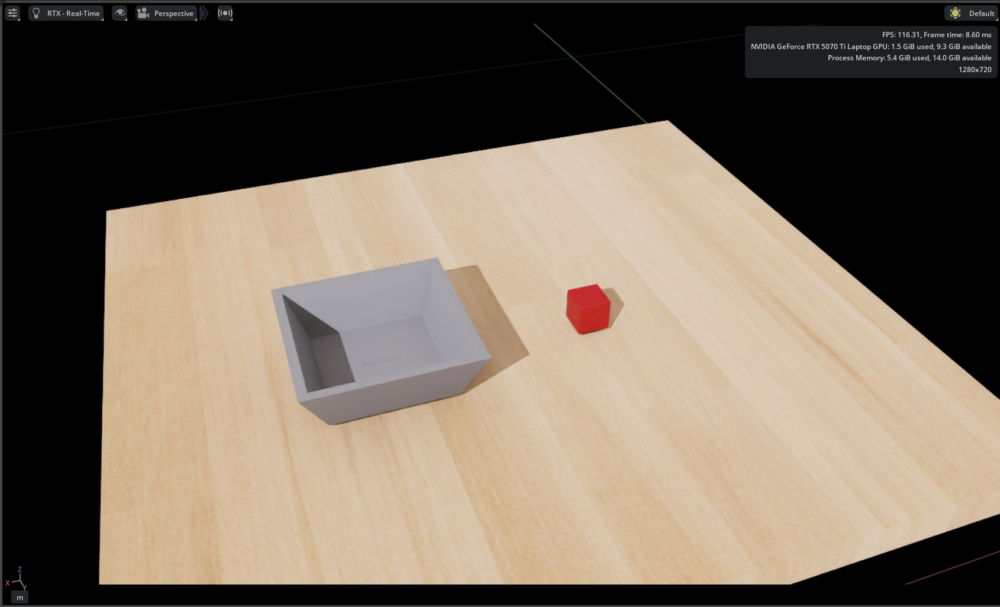
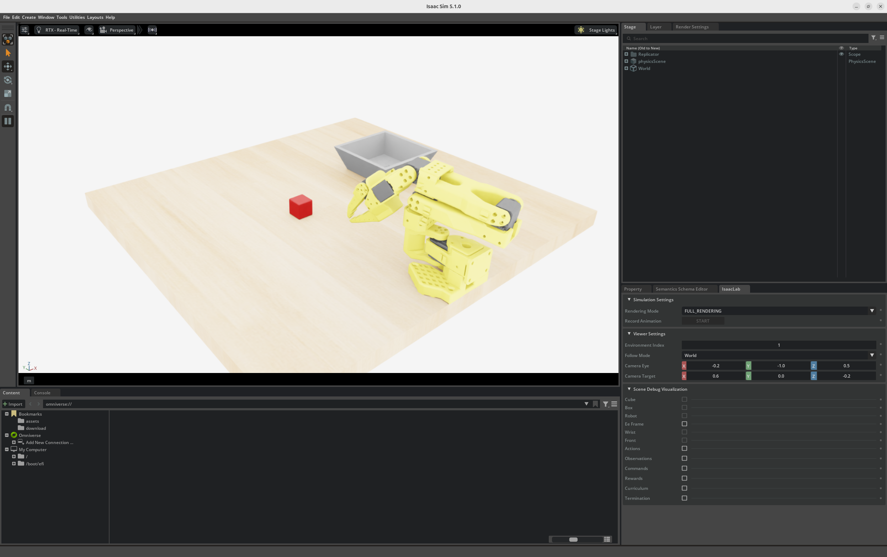

# 在 LeIsaac 中添加自定义任务

本教程将引导您在 LeIsaac 中添加自定义任务和环境，以便您可以基于它构建各种任务。

## 1. 准备 USD 场景

LeIsaac 中的每个任务环境都与一个 USD 场景相关联。我们假设您已经有一个环境的 USD 文件。如果没有，您可以重用包含桌子、红色立方体和盒子的示例场景。示例场景可以[在此处下载](https://drive.google.com/file/d/1hRmwRzN_9SXLD0_CJjkT4LsQ7zNpeesc/view?usp=sharing)。

场景 USD 只需要描述场景本身；不需要机器人资产。下载后，将文件放在项目根目录下的 `assets/scenes` 中。


*Isaac Sim 中的示例场景布局。*


## 2. 添加资产配置

一旦场景文件准备好，在代码中添加资产配置。LeIsaac 源代码的根目录是 `source/leisaac/leisaac`。

在 `source/leisaac/leisaac` 中，创建 `assets/scenes/custom_scene.py`，内容如下：

```python
from pathlib import Path

import isaaclab.sim as sim_utils
from isaaclab.assets import AssetBaseCfg
from leisaac.utils.constant import ASSETS_ROOT

"""Configuration for the Custom Scene"""
SCENES_ROOT = Path(ASSETS_ROOT) / "scenes"

CUSTOM_SCENE_USD_PATH = str(SCENES_ROOT / "custom_scene" / "scene.usd")

CUSTOM_SCENE_CFG = AssetBaseCfg(
    spawn=sim_utils.UsdFileCfg(
        usd_path=CUSTOM_SCENE_USD_PATH,
    )
)
```

`CUSTOM_SCENE_USD_PATH` 指向场景的 USD 入口文件。您可以根据需要重命名文件或变量，只需相应地更新引用即可。

## 3. 实现任务代码

接下来，实现任务逻辑。LeIsaac 为不同的机器人提供了任务模板（详见 [templates](https://github.com/LightwheelAI/leisaac/tree/main/source/leisaac/leisaac/tasks/template)）。在本例中，我们使用单臂任务中的 SO101 follower：拾取红色立方体并将其放入盒子中。

创建 `tasks/custom_task/custom_task_env_cfg.py`：

```python
import torch

from isaaclab.assets import AssetBaseCfg, RigidObject
from isaaclab.managers import SceneEntityCfg
from isaaclab.managers import TerminationTermCfg as DoneTerm
from isaaclab.utils import configclass

from leisaac.assets.scenes.custom_scene import CUSTOM_SCENE_CFG, CUSTOM_SCENE_USD_PATH
from leisaac.utils.general_assets import parse_usd_and_create_subassets
from leisaac.utils.domain_randomization import domain_randomization, randomize_object_uniform

from ..template import (
    SingleArmObservationsCfg,
    SingleArmTaskEnvCfg,
    SingleArmTaskSceneCfg,
    SingleArmTerminationsCfg,
)


@configclass
class CustomTaskSceneCfg(SingleArmTaskSceneCfg):
    """Scene configuration for the custom task."""

    scene: AssetBaseCfg = CUSTOM_SCENE_CFG.replace(prim_path="{ENV_REGEX_NS}/Scene")


def cube_in_box(env, cube_cfg: SceneEntityCfg, box_cfg: SceneEntityCfg, x_range: tuple[float, float], y_range: tuple[float, float], height_threshold: float):
    """Termination condition for the object in the box."""
    done = torch.ones(env.num_envs, dtype=torch.bool, device=env.device)

    box: RigidObject = env.scene[box_cfg.name]
    box_x = box.data.root_pos_w[:, 0] - env.scene.env_origins[:, 0]
    box_y = box.data.root_pos_w[:, 1] - env.scene.env_origins[:, 1]

    cube: RigidObject = env.scene[cube_cfg.name]
    cube_x = cube.data.root_pos_w[:, 0] - env.scene.env_origins[:, 0]
    cube_y = cube.data.root_pos_w[:, 1] - env.scene.env_origins[:, 1]
    cube_z = cube.data.root_pos_w[:, 2] - env.scene.env_origins[:, 2]

    done = torch.logical_and(done, cube_x < box_x + x_range[1])
    done = torch.logical_and(done, cube_x > box_x + x_range[0])
    done = torch.logical_and(done, cube_y < box_y + y_range[1])
    done = torch.logical_and(done, cube_y > box_y + y_range[0])
    done = torch.logical_and(done, cube_z < height_threshold)

    return done


@configclass
class TerminationsCfg(SingleArmTerminationsCfg):
    """Termination configuration for the custom task."""
    success = DoneTerm(
        func=cube_in_box,
        params={
            "cube_cfg": SceneEntityCfg("cube"),
            "box_cfg": SceneEntityCfg("box"),
            "x_range": (-0.05, 0.05),
            "y_range": (-0.05, 0.05),
            "height_threshold": 0.10,
        },
    )


@configclass
class CustomTaskEnvCfg(SingleArmTaskEnvCfg):
    """Configuration for the custom task environment."""

    scene: CustomTaskSceneCfg = CustomTaskSceneCfg(env_spacing=8.0)

    observations: SingleArmObservationsCfg = SingleArmObservationsCfg()

    terminations: TerminationsCfg = TerminationsCfg()

    task_description: str = "pick up the red cube and place it into the box."

    def __post_init__(self) -> None:
        super().__post_init__()

        self.viewer.eye = (-0.2, -1.0, 0.5)
        self.viewer.lookat = (0.6, 0.0, -0.2)

        self.scene.robot.init_state.pos = (0.35, -0.64, 0.01)

        parse_usd_and_create_subassets(CUSTOM_SCENE_USD_PATH, self)

        domain_randomization(
            self,
            random_options=[
                randomize_object_uniform(
                    "cube",
                    pose_range={
                        "x": (-0.05, 0.05),
                        "y": (-0.05, 0.05),
                        "z": (0.0, 0.0),
                    },
                ),
                randomize_object_uniform(
                    "box",
                    pose_range={
                        "x": (-0.05, 0.05),
                        "y": (-0.05, 0.05),
                        "z": (0.0, 0.0),
                    },
                ),
            ],
        )
```

以下是代码的一些说明：

- `CustomTaskSceneCfg` 继承自 `SingleArmTaskSceneCfg` 并将 `scene` 字段设置为 `CUSTOM_SCENE_CFG`。
- `TerminationsCfg` 继承自 `SingleArmTerminationsCfg`。它保留默认的超时设置并添加 `cube_in_box`，该函数检查立方体和盒子的位置以决定任务是否成功。
- `CustomTaskEnvCfg` 继承自 `SingleArmTaskEnvCfg` 并提供 `scene`、`observations` 和 `terminations`。默认观测包括关节位置/速度、动作等。您也可以添加任何自定义观测。
- 在 `__post_init__` 中，您可以进一步调整环境配置：
  - `viewer.eye` / `viewer.lookat` 定义启动此任务时 IsaacSim UI 视口的视角。
  - `scene.robot.init_state.pos` 设置机器人生成位姿。
  - `parse_usd_and_create_subassets` 从 USD 中提取子资产到交互场景中。
  - `domain_randomization` 添加随机性；例如，`randomize_object_uniform` 在每次重置时在范围内抖动对象位姿。

## 4. 注册环境

最后，通过添加 `tasks/custom_task/__init__.py` 来注册任务环境：

```python
import gymnasium as gym

gym.register(
    id="LeIsaac-SO101-CustomTask-v0",
    entry_point="isaaclab.envs:ManagerBasedRLEnv",
    disable_env_checker=True,
    kwargs={
        "env_cfg_entry_point": f"{__name__}.custom_task_env_cfg:CustomTaskEnvCfg",
    },
)
```

## 5. 运行您的任务

注册任务后，使用标准脚本启动它。例如，通过遥操作脚本启动：

```bash
python scripts/environments/teleoperation/teleop_se3_agent.py \
    --task=LeIsaac-SO101-CustomTask-v0 \
    --teleop_device=so101leader \
    --num_envs=1 \
    --device=cuda \
    --enable_cameras
```


*使用遥操作运行的自定义任务。*
