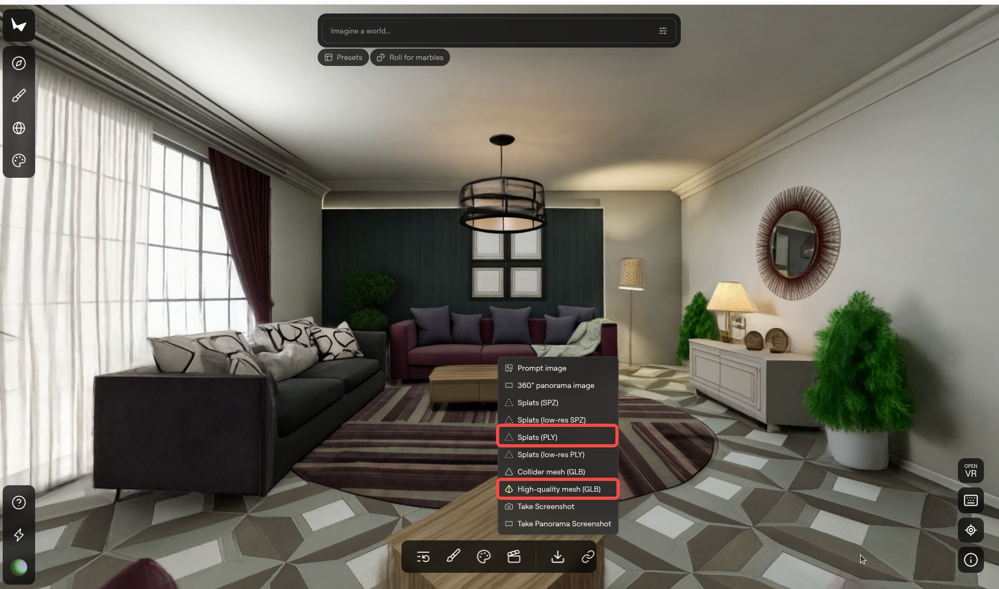

# LeIsaac × Marble：具身环境的大规模泛化与定制

本教程将引导您如何将 **Marble-Generate** 场景集成到 **LeIsaac** 中，使您能够在大规模泛化环境中构建和评估各种具身任务。

## 🎥 Marble 泛化场景集

<div style="display: grid; grid-template-columns: 1fr 1fr; gap: 1rem; margin: 1rem 0;">
  <div style="text-align: center;">
    <video src="https://github.com/user-attachments/assets/43163069-9c35-4a7e-a7c5-6c309b98061d"
      autoPlay loop muted playsInline style="max-height: 250px; width: 100%;"></video>
  </div>
  <div style="text-align: center;">
    <video src="https://github.com/user-attachments/assets/b6580022-9f6b-428f-ab27-a4dae0248e0e"
      autoPlay loop muted playsInline style="max-height: 250px; width: 100%;"></video>
  </div>
</div>

## 步骤 1：准备 USD 场景

要在 **LeIsaac** 中添加自定义场景，首先需要使用 **Marble** 准备一个兼容 USD 的场景。

### 1.1 在 Marble 中创建世界

导航至 **[Marble 平台](https://marble.worldlabs.ai/)**。

按照 **[Marble 文档](https://docs.worldlabs.ai/)** 中的说明创建您的自定义世界模型。当您对结果满意时，下载以下文件：

- **Splats 文件**（`.ply`）
- **高质量网格（推荐）**（`.glb`）或 **碰撞器网格**（`.glb`）



::::tip
- 为了获得最佳效果，请使用高分辨率图像或视频。
- 建议在生成完整世界之前完善并最终确定 **全景图**。
- **真实世界捕捉技巧：** 使用 **眼睛水平视角**，保持 **适中距离**，并 **无遮挡地** 捕捉场景。**避免从上到下或从下到上的角度**，并确保镜子中出现的物体也能直接看到。
- 如果可能，**使用全景图像** 通常可以提高空间完整性、背景连续性和整体清晰度。**全景** 资源可以参考：[PolyHaven](https://polyhaven.com/)，或者您可以捕捉自己的 **多角度图像并将其输入到 Marble 中。**
::::

### 1.2 将 Splats (PLY) 转换为 USDZ

获取 splats 文件（`.ply`）后，需要使用 **NVIDIA 3DGrut** 将其转换为 **USDZ** 格式。

#### 安装 3DGrut
下载并安装 **[3DGrut](https://github.com/nv-tlabs/3dgrut)**。

按照仓库中提供的安装说明进行操作。

::::info
如果您在 RTX 50 系列 GPU 上遇到安装问题，这个相关的 [issue](https://github.com/nv-tlabs/3dgrut/issues/167) 可能会有所帮助。
::::

#### 将 PLY 转换为 USDZ

要将 splat 数据从 **PLY 格式** 转换为 **USDZ 格式**，运行以下命令：

```bash
python -m threedgrut.export.scripts.ply_to_usd path/to/your/splats.ply \
    --output_file path/to/output.usdz
```

### 1.3 在 Isaac Sim 中集成高斯渲染和网格碰撞

在这一步中，我们将 **高斯泼溅** 用于高质量视觉渲染，并将 **网格几何** 用于精确的物理碰撞。结果是一个单一的、完整的 USD 场景，作为下一步的 **背景场景**。

#### 1.3.1：加载并对齐高斯场景和碰撞网格

- 首先双击生成的 `.usdz` 文件以提取其内容。在提取的文件夹中找到 `default.usda` 并将其拖入 **Isaac Sim GUI 视口** 以加载用于渲染的高斯泼溅场景。
- 接下来，在 **Stage** 面板中，在 `/World/Xform` 处创建一个 Xform，选择它，并使用 **绝对文件路径** 添加对 `texture_mesh.glb` 文件的引用。此时，场景应包含用于高斯渲染的 `/World/gauss` 和用于基于网格的碰撞的 `/World/Xform`。
- 在调整网格之前，首先确保 `/World/gauss` **与世界坐标系对齐**。然后 **将 `/World/Xform` 对齐以匹配高斯场景**。始终确保高斯泼溅和网格几何在视口中正确重叠。
   * 在大多数情况下，将 `/World/Xform` **绕 Z 轴旋转 180 度** 就足够了。根据源数据，您可能还需要应用缩放（通常为 ×100）或额外的平移和旋转调整。
   * 在此示例中，`/World/gauss` 首先 **绕 X 轴旋转 180 度**，`/World/Xform` **绕 X 轴旋转 90 度**，然后 **绕 Z 轴旋转 180 度** 以实现正确对齐。

<video controls
  src="https://github.com/user-attachments/assets/8a30d743-8deb-4f8b-b663-99914f665339" style="width: 100%; max-width: 960px; border-radius: 8px;"></video>

#### 1.3.2：为网格配置物理和碰撞器

- 对齐完成后，在碰撞网格上配置物理。选择 `/World/Xform` 并使用 **Rigid Body with Colliders Preset** 添加物理，然后在 **Rigid Body** 设置中启用 **Kinematic**，使网格表现为静态碰撞对象。
- 接下来，找到 `/World/Xform` 下的网格 prim（通常是 `/World/Xform/decimated_mesh` 或 `/World/Xform/decimated_mesh/Mesh0`，即 **Type 为 `Mesh` 的 prim**）。在 **Physics → Collider** 下，将 **Approximation** 模式设置为 `meshSimplification`。此设置在保持良好仿真性能的同时提供准确的碰撞行为。

<video controls
  src="https://github.com/user-attachments/assets/c5e312b4-4d65-49b8-bee9-94d12595edce" style="width: 100%; max-width: 960px; border-radius: 8px;"></video>

#### 1.3.3：优化视觉效果并导出最终 USD

- 为了提高视觉质量，您可以选择 **隐藏网格几何体并仅保留高斯泼溅可见**，同时仍然保留底层碰撞体积。
- 可以在需要调试或检查时启用 **碰撞可视化**。
- 一旦验证了渲染和碰撞行为，**将组合场景保存为单个 USD 文件**（例如 `scene.usd`）。此 USD 将在下一步中用作 **背景场景**。

<video controls
  src="https://github.com/user-attachments/assets/55e3ba79-df1d-4189-9359-5b64c5ded54a" style="width: 100%; max-width: 960px; border-radius: 8px;"></video>

## 步骤 2：任务的场景组合

**LeIsaac** 中的一些操作任务（例如 **布料折叠**、**玩具清理**）是在 **桌面表面** 上执行的。
为了支持各种自定义场景，**LeIsaac** 将以下内容分开：

- **背景场景**
- **机器人**
- **任务资产**（对象和可选桌子）

这种设计使任务执行在不同环境中更加稳健。

### 2.1 向场景中添加机器人资产

#### 2.1.1：放置机器人

1. 运行 **Isaacsim** 并加载 **步骤 1.3** 中导出的背景 USD。
2. 创建一个新的 `Xform`。
3. 在此 `Xform` 下将 **SO101 Follower** USD 添加为 **引用**。
4. 将机器人拖动到场景中的期望位姿。

机器人 USD 文件位于 `assets/robots` 中：

记录机器人变换：

- **平移**：**(x, y, z)**
- **方向**：四元数 **(w, x, y, z)**

<video controls
  src="https://github.com/user-attachments/assets/bd511d11-3395-4466-92e8-6f1f82ead1b8" style="width: 100%; max-width: 960px; border-radius: 8px;"></video>

#### 2.1.2：组合场景
要组合场景与资产，请使用记录的 **机器人变换** 作为目标位姿，通过将其传递给 `--target-pos` 和 `--target-quat`。

运行以下脚本：

```bash
python scripts/tutorials/marble_compose.py \
  --task your_task \
  --background path/to/background_scene.usd \
  --output path/to/output.usd \
  --assets-base /path/to/assets \
  --target-pos X Y Z \
  --target-quat W X Y Z
```

<details>
<summary><strong>marble_compose.py 的参数描述</strong></summary>

- `--task`：任务类型（`toys`、`orange`、`cloth`、`cube`）。
- `--background`：背景场景 USD（来自步骤 1.3）。
- `--output`：输出 USD 路径。
- `--assets-base`：任务相关资产 USD 的基目录。
- `--target-pos`：机器人位置 `(x, y, z)`。
- `--target-quat`：机器人方向四元数 `(w, x, y, z)`。
- `--include-table`：包含特定于任务的桌子资产
  （参见 [桌子替换](#22-桌子替换)）。
- `--dual-arm`：启用双臂配置
  （参见 [双臂配置](#23-双臂配置)）。

</details>

::::info[💡 **为什么包含桌子选项？**]
自定义背景场景可能没有可靠的桌子。启用 `--include-table` 会插入经过良好测试的桌子资产以确保稳定的任务执行。
::::

### 2.2 桌子替换

适用于 **布料** 和 **玩具** 任务。

如果您的背景场景没有提供稳定的桌面，请使用此选项。
桌子 USD 文件位于 `assets/scenes` 中相应任务目录下：

* **toys**：`KidRoom_Table01`
* **cloth**：`Table038`

#### 2.2.1：放置桌子
1. 为桌子创建一个新的 `Xform` prim。
2. 在此 `Xform` 下将 **桌子 USD** 添加为 **引用**。
3. 禁用加载的桌子 USD 的 **物理**。
4. 对 `Xform` 应用 **Rigid Body with Colliders Preset**。
5. 将桌子移动到适当位置并按一次 **Play** 让其在重力作用下稳定下来。
6. 记录桌子变换：
   - **平移**：`(x, y, z)`
   - **方向**：四元数 **(w, x, y, z)**

<video controls
  src="https://github.com/user-attachments/assets/4f9d0c8c-4951-4436-a4ea-de47c5a6a7f6" style="width: 100%; max-width: 960px; border-radius: 8px;"></video>

#### 2.2.2：组合场景
要组合场景，请运行以下脚本：

```bash
python scripts/tutorials/marble_compose.py \
  --task your_task \
  --background path/to/scene.usd \
  --output path/to/output.usd \
  --assets-base /path/to/assets \
  --target-pos X Y Z \
  --target-quat W X Y Z \
  --include-table
```

---

### 2.3 双臂配置

默认情况下，任务使用 **单臂 SO101 Follower** 作为参考。

对于双臂任务，工作流程保持不变，但有一个关键假设：

> **左臂参考**
> 您仍然使用 **一个单臂 SO101 Follower** 来定位期望位姿。
> 此机器人在双臂设置中被视为 **左臂**

要组合场景，请运行以下脚本：

```bash
python scripts/tutorials/marble_compose.py \
  --task your_task \
  --background path/to/scene.usd \
  --output path/to/output.usd \
  --assets-base /path/to/assets \
  --target-pos X Y Z \
  --target-quat W X Y Z \
  --include-table \
  --dual-arm
```

## 步骤 3：验证场景

组合场景 USD 后，您需要验证它是否可以正确加载和操作。


### 3.1 用自定义场景替换默认场景

所有场景配置都定义在：

```shell
leisaac/source/leisaac/leisaac/assets/scenes
```

以 toyroom 为例：

```python
from pathlib import Path

import isaaclab.sim as sim_utils
from isaaclab.assets import AssetBaseCfg
from leisaac.utils.constant import ASSETS_ROOT

"""Configuration for the Toy Room Scene"""
SCENES_ROOT = Path(ASSETS_ROOT) / "scenes"

LIGHTWHEEL_TOYROOM_USD_PATH = str(SCENES_ROOT / "lightwheel_toyroom" / "scene.usd")

LIGHTWHEEL_TOYROOM_CFG = AssetBaseCfg(
    spawn=sim_utils.UsdFileCfg(
        usd_path=LIGHTWHEEL_TOYROOM_USD_PATH,
    )
)

```

::::info[**您需要更改的内容**]
- 将 `"LIGHTWHEEL_TOYROOM_USD_PATH"` 替换为您组合的 USD 路径。
::::

### 3.2 通过遥操作验证（`teleop_se3_agent.py`）

更新任务配置后，使用遥操作脚本 **验证场景是否正确组合**。

运行遥操作脚本：

```bash
python scripts/environments/teleoperation/teleop_se3_agent.py \
    --task=LeIsaac-SO101-CleanToyTable-v0 \
    --teleop_device=so101leader \
    --port=/dev/ttyACM0 \
    --num_envs=1 \
    --device=cuda \
    --enable_cameras \
    --record \
    --dataset_file=./datasets/dataset.hdf5
```

#### 结果示例

<div style="display: grid; grid-template-columns: 1fr 1fr; gap: 1rem; margin: 1rem 0;">
  <div style="text-align: center;">
    <video
      src="https://github.com/user-attachments/assets/42899f7e-2513-4ede-859b-a259b187816f"
      controls muted playsInline style="max-height: 250px; width: 100%;"></video>
  </div>
  <div style="text-align: center;">
    <video src="https://github.com/user-attachments/assets/d264f1ef-e094-4935-8c88-5b6af3874eac"
      controls muted playsInline style="max-height: 250px; width: 100%;"></video>
  </div>
</div>
